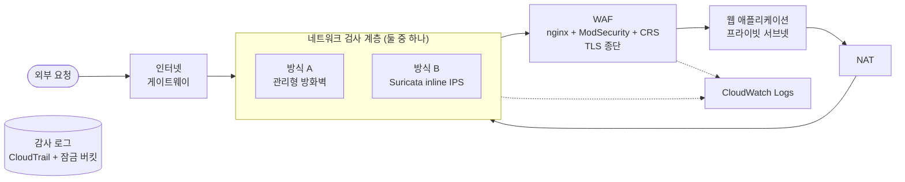

# AWS SOC Lab — Terraform 재구성

2025년 콘솔에서 손으로 만들었던 클라우드 보안관제 환경을 Terraform으로 다시 만들었다. 같은 구조를 코드로 옮기면서, 원래 환경을 다시 살펴보다 찾은 결함 16건을 고쳤다.

가장 큰 목적은 네트워크 방화벽을 관리형(AWS Network Firewall)과 직접 운영(EC2 위의 Suricata) 두 가지로 만들고, 같은 요구사항을 만족하는 두 구현이 운영에서 어떻게 다른지 실제로 재 보는 것이었다. 비교의 결론과 근거는 [`docs/06-comparison.md`](docs/06-comparison.md)에 있다.

> 이 환경은 운영용 설계가 아니라 검증용이다. 계층마다 무엇이 보이는지 관찰하려고 일부러 남겨 둔 구성이 있다. 운영 환경과 다른 점과 그 이유는 [`docs/03-architecture.md`](docs/03-architecture.md) 5절에 적었다.

## 결과 요약

| 항목 | 결과 |
|---|---|
| 웹 방화벽 탐지율 | 규칙 집합이 없던 원본 0%에서 44.7%. 앱이 입력을 읽는 위치(질의 문자열, JSON 본문)만 보면 80.1% |
| 실제 사용 흐름 오탐 | 모든 측정에서 0건 |
| 두 방화벽 방식 | 같은 룰로 평문 공격 17건과 16건을 막았고, 판정이 갈린 요청은 1건 |
| 운영 비교 | 관리형은 시간당 약 $0.50에 기동 6분, 직접 운영은 약 $0.12에 기동 2분 |
| 인수 기준 | 11건 모두 충족 ([`docs/05-verification.md`](docs/05-verification.md)) |
| 요구사항 | 46건 중 충족 40, 부분 충족 4, 미구현 2(선택과 권장 항목) |

## 재구성 배경

원래 환경은 다시 만들 수가 없었다. 인스턴스를 새로 만들면 사설 주소가 바뀌는데 로그 수집 설정에 그 주소가 적혀 있어서, 수집이 아무 경고 없이 끊겼다. 구성을 바꾸는 비용이 커서 한번 만든 환경을 그대로 두고 쓰는 수밖에 없었다.

구축 매뉴얼을 다시 읽으면서 결함 16건(`F1`~`F16`)도 찾았다. 가장 심각한 결함은 웹 방화벽에 규칙 집합이 설치되지 않아 탐지 규칙이 0개였다는 점으로, 방어라고 불렀지만 실제로는 요청을 기록만 하고 있었다. 전체 목록은 [`docs/01-requirements.md`](docs/01-requirements.md) 부록 A에 있다.

## 아키텍처



두 방식은 같은 Suricata 엔진에 같은 룰 파일을 쓴다. 엔진과 룰을 같게 두었기 때문에 두 방식의 차이는 운영 모델에서만 나온다. 방식은 변수로 고르고, 네트워크 구조는 그대로 둔 채 경로의 목적지만 바뀐다. 감사 로그는 랩과 별개로 늘 떠 있는 환경에 있어서, 랩을 만들고 지우는 호출까지 기록된다.

## 측정한 것

### 웹 방화벽 규칙 집합

같은 요청 618건을 세 상태에서 보냈다. 공격 페이로드는 GoTestWAF v0.5.8의 테스트 케이스를 가져다 썼고, 측정 도구는 직접 만들었다([`tools/probe/`](tools/probe/), [`ADR-020`](docs/adr/020-in-house-probe-tool.md)). 요청마다 번호표를 붙여 각 계층의 로그에서 찾기 때문에, 차단하지 않는 탐지 전용 상태에서도 몇 건을 잡았는지 셀 수 있다.

| 상태 | 공격 탐지 | 차단 | 실제 트래픽 오탐 |
|---|---|---|---|
| 규칙 집합 없음 (원본 재현) | 0% | 0 | 0 |
| CRS 파라노이아 1, 탐지 전용 | 35.0% | 0 | 0 |
| CRS 파라노이아 2, 탐지 전용 | 44.7% | 0 | 0 |
| CRS 파라노이아 2, 차단 | 44.7% | 44.7% | 0 |

파라노이아 레벨을 2로 올리자 탐지가 9.7%p 올랐고 실제 트래픽 오탐은 그대로 0건이었다. 레벨 1에서는 NoSQL 주입을 하나도 잡지 못했다. 근거는 [`ADR-021`](docs/adr/021-record-versions-and-paranoia-level.md)에 있다.

탐지율은 공격을 넣은 위치에 따라 크게 달랐다. HTTPS 공격 309건 기준으로 질의 문자열 82.1%, JSON 본문 78.2%, URL 경로 14.1%, 사용자 정의 헤더 2.7%였다. 경로와 사용자 정의 헤더는 이 앱이 입력으로 쓰지 않는 위치라서, 두 곳까지 검사하도록 규칙을 넓혀도 막을 공격은 늘지 않고 오탐만 늘어나기 때문에 규칙은 그대로 두었다.

### 계층마다 보이는 범위

네트워크 검사 계층은 TLS를 종료하기 전에 있어서 암호화된 요청은 암호문으로만 본다. 같은 요청을 평문(80)과 암호화(443)로 나눠 보내자 암호화 경로에서 네트워크 계층은 한 건도 잡지 못했고, 막은 것은 전부 웹 방화벽이었다. 관리형 방화벽의 TLS 검사를 켜면 볼 수 있지만, 시간당 비용이 크게 늘고 서버 개인 키를 맡겨야 해서 쓰지 않았다([`ADR-025`](docs/adr/025-no-firewall-tls-inspection.md)).

평문 경로에서 네트워크 계층이 막은 요청은 대부분 웹 방화벽도 막는 요청이었다. 네트워크 계층만 할 수 있었던 일은 내부에서 밖으로 나가는 통신의 통제로, 앱 서버가 표식 호스트로 보낸 요청이 NAT을 지나 이 계층에서 막혔다.

### 두 방식 비교

| | 방식 A (관리형 방화벽) | 방식 B (Suricata on EC2) |
|---|---|---|
| 평문 경로에서 막은 요청 | 17건 | 16건 |
| 검사 계층 기동 | 5분 45초 | 약 1분 |
| 전체 삭제 | 약 5분 30초 | 약 80초 |
| 전체 기동 시 시간당 비용 | 약 $0.50 | 약 $0.12 |
| 검사가 멈추면 | 사용자가 고를 수 없음 | 막도록 직접 구성하고 시험함 |
| 이상 동작의 원인 | 설정과 카운터를 볼 수 없음 | 설정과 카운터로 확인함 |

판정이 갈린 1건은 질의 문자열에 인코딩된 교차 사이트 스크립팅 페이로드였다. 관리형만 잡았는데, 질의 문자열을 디코딩하는 기본 설정이 다른 것으로 보고 있다.

직접 운영 방식은 Suricata를 멈추면 트래픽을 막도록 만들었다([`ADR-012`](docs/adr/012-inline-ips-fail-close.md)). 실제로 멈춰 보니 웹 서비스가 끊겼고 Suricata 인스턴스에는 들어가 다시 켤 수 있었지만, 앱의 관리 접속도 같이 끊겼다. 앱이 밖으로 나가는 연결도 Suricata를 거치기 때문이다. 다시 켠 뒤에는 그전에 맺어진 연결이 버려져서 앱의 관리 접속이 6분쯤 뒤에 돌아왔다([`ADR-027`](docs/adr/027-suricata-inline-on-ec2.md)).

검증용으로 자주 올리고 내리는 환경이라면 직접 운영이, 계속 띄워 두는 서비스라면 관리형이 맞다고 결론 내렸다. 자세한 비교는 [`docs/06-comparison.md`](docs/06-comparison.md)에 있다.

## 로그와 감사

WAF 감사 로그와 Suricata 경보는 에이전트가 CloudWatch로 보낸다. 에이전트는 AWS가 공개한 공개키 지문을 코드에 적어 두고, 그 키로 서명된 패키지일 때만 설치한다([`ADR-028`](docs/adr/028-cloudwatch-agent-signature.md)). WAF 로그는 비밀번호가 담기는 경로의 요청 본문을 기록하기 전에 뺀다. ModSecurity 3은 값을 가리는 기능을 지원하지 않아 기록 범위를 줄이는 방식으로 막았다([`ADR-029`](docs/adr/029-mask-before-logging.md)).

두 방식의 경보는 필드 이름이 같고 한쪽만 한 겹 더 감싸져 있어서 쿼리와 대시보드 하나로 함께 읽는다. 요청 하나를 번호표로 찾으면 WAF 로그와 네트워크 계층 로그 양쪽에서 나온다. 여기서 CloudWatch는 로그를 모으고 조사하는 곳으로 썼다. 운영 환경이라면 이 로그를 SIEM으로 넘겨 관제한다([`ADR-030`](docs/adr/030-collection-point-not-siem.md)).

AWS API 호출은 CloudTrail이 전 리전에서 기록하고, 규정 준수 모드로 잠근 S3 버킷에 하루 동안 지울 수 없게 보관한다. 관리자 역할로 삭제와 보존 기간 단축을 시도해 모두 거부되는 것을 확인했다. 무결성 검증에서는 로그 파일 하나가 누락으로 나왔는데, 잠금 시험 때 남은 삭제 표시가 그 파일을 가리고 있었고 표시를 지우자 14개 모두 유효로 돌아왔다([`ADR-032`](docs/adr/032-persistent-audit-trail.md)).

## 검증

| 검사 | 언제 | 내용 |
|---|---|---|
| 비밀값 검사 (gitleaks) | 병합 전 필수 | 커밋 이력 전체. 계정 ID가 든 ARN을 잡는 규칙을 따로 둠 |
| 형식, 구문, 모듈 테스트 | 병합 전 필수 | 모듈 테스트 16개가 경로 전환, 공개 범위, IMDSv2, 암호화 같은 결정을 고정 |
| IaC 보안 검사 (Trivy) | 병합 전 필수 | HIGH, CRITICAL이면 병합 불가. 처음 돌렸을 때 세 인스턴스의 디스크가 암호화되지 않은 것을 찾아 고침 |
| 자체 감사 (Prowler) | 배포 후 | 실패 121건 중 계정 설정 11건을 고치고 나머지는 근거를 기록 ([`docs/04-audit-prowler.md`](docs/04-audit-prowler.md)) |
| 배포 검증 (`tools/verify`) | 배포 후 | 손으로 하던 점검 12가지를 명령 하나로. 12개 모두 통과, 약 100초 |

CI는 AWS 자격증명을 쓰지 않는다. 공개 저장소의 CI가 계정에 닿지 않도록 코드만 읽는 검사로 한정했다([`ADR-033`](docs/adr/033-ci-security-gates.md)).

## 진행 상황

| 단계 | Phase | 상태 |
|---|---|:--:|
| 설계 | 1 요구사항 정의 | ✅ |
| | 2 위협 모델링 | ✅ |
| | 3 아키텍처 설계와 ADR | ✅ |
| 구현 | 4 구현 준비와 원격 상태 | ✅ |
| | 5 네트워크 | ✅ |
| | 6 웹서버와 세션 관리자 | ✅ |
| | 7 WAF와 규칙 집합 | ✅ |
| | 8 방식 A 관리형 방화벽 | ✅ |
| | 9 방식 B Suricata inline IPS | ✅ |
| | 10 로그 수집과 감사 | ✅ |
| 검증 | 11 측정, 감사, 판정, 문서화 | ✅ |

설계를 먼저 끝낸 것은 구현을 시작한 뒤에는 되돌리기 어려운 결정이 있어서였다. 위협 모델을 만들다가 아웃바운드 검사 요구사항(`FR-10`)이 빠져 있던 것을 찾아 설계에 넣었다.

## 문서

| 문서 | 내용 |
|---|---|
| [`01-requirements.md`](docs/01-requirements.md) | 기능 10, 비기능 9, 보안 27, 인수 기준 11, 원본 결함 16건 |
| [`02-threat-model.md`](docs/02-threat-model.md) | 신뢰 경계 5개, 위협 44건, 데이터 흐름도, 받아들인 위험 |
| [`03-architecture.md`](docs/03-architecture.md) | 전체와 상세 설계, 주소 체계, 라우팅, 보안 그룹, 로그 파이프라인, 운영 환경과의 차이 |
| [`04-audit-prowler.md`](docs/04-audit-prowler.md) | 자체 감사 결과와 조치, 받아들인 항목과 근거 |
| [`05-verification.md`](docs/05-verification.md) | 인수 기준 판정, 요구사항 46건의 추적성 매트릭스 |
| [`06-comparison.md`](docs/06-comparison.md) | 두 방식 비교와 결론 |
| [`adr/`](docs/adr/) | 설계 결정 36건. 맥락, 결정, 근거, 검토한 대안, 결과 |

ADR마다 고르지 않은 선택지와 그 이유를 같이 적었다. 대안을 보지 않고 내린 결정과 보고 나서 버린 결정은 다르기 때문이다. 배포해 본 뒤 결과가 예상과 달랐던 것은 해당 ADR의 「배포 후 확인」에 덧붙였다.

## 저장소 구조

```
bootstrap/          상태 버킷. 로컬 상태로 한 번만 실행
envs/
  audit/            늘 떠 있는 감사 환경. CloudTrail, 잠금 버킷, 예산, 계정 기본 설정
  lab/              랩 배포 진입점. 필요할 때 만들고 지운다
modules/
  network/          VPC, 서브넷, 라우팅, 게이트웨이, 보안 그룹
  web/              앱 인스턴스와 내부 TLS 종단
  waf/              웹 방화벽 인스턴스와 규칙 집합
  secrets/          내부 인증 기관 인증서를 전달하는 시크릿
  firewall_managed/ 방식 A. 관리형 방화벽
  firewall_oss/     방식 B. Suricata inline IPS
  observability/    흐름 로그, 지표, 경보, 대시보드
rules/              두 방식이 같이 쓰는 Suricata 룰
scripts/            인스턴스들이 같이 쓰는 설치 스크립트 (에이전트, 시간 동기화)
tools/
  probe/            계층별 탐지 측정 도구
  verify/           배포 검증 스크립트
docs/               설계 문서와 ADR
```

`bootstrap/`을 따로 둔 것은 상태를 저장할 버킷을 만드는 작업 자체의 상태를 둘 곳이 없어서다. 버킷을 만드는 코드만 로컬 상태로 돌리고 나머지는 모두 그 버킷에 상태를 둔다.

## 실행

Terraform 1.10 이상이 필요하다. S3의 자체 잠금을 쓰기 때문에 잠금용 테이블은 따로 만들지 않는다.

```bash
# 1. 상태 버킷 (처음 한 번)
cd bootstrap
terraform init && terraform apply

# 2. 감사 환경 (처음 한 번, 이후 계속 둔다)
cd ../envs/audit
cp backend.hcl.example backend.hcl              # 실제 값으로 채운다
cp terraform.tfvars.example terraform.tfvars    # 예산 알림 받을 주소
terraform init -backend-config=backend.hcl
terraform apply

# 3. 랩
cd ../lab
cp backend.hcl.example backend.hcl
terraform init -backend-config=backend.hcl
terraform apply                                   # 방식 A, 경로는 그대로
terraform apply -var=route_through_firewall=true  # 관리 접속을 확인한 뒤 경로 전환

# 4. 검증
cd ../../tools/verify
../probe/.venv/Scripts/python.exe verify.py

# 5. 정리 (랩만)
cd ../../envs/lab
terraform destroy -var=route_through_firewall=true
```

랩을 만들 때 `checkip.amazonaws.com`으로 실행하는 장비의 공인 주소를 조회해 웹 방화벽 인바운드에 넣는다. 그래서 배포한 장비에서만 웹 방화벽에 접속할 수 있다. Windows PowerShell에서는 `-이름=값` 형태의 인자를 따옴표로 감싸야 한다(`terraform init "-backend-config=backend.hcl"`).

### 검사 방식 고르기

| 변수 | 정하는 것 | 값 | 기본값 |
|---|---|---|---|
| `firewall_mode` | 어느 방식을 만들지 | `managed` (방식 A) / `oss` (방식 B) | `managed` |
| `route_through_firewall` | 트래픽을 검사 계층으로 보낼지 | `true` / `false` | `false` |

검사 계층을 먼저 만들고 관리 접속을 확인한 다음 경로를 켠다. 두 가지를 한 번에 적용하면 문제가 생겼을 때 정책 탓인지 경로 탓인지 구분할 수 없고, 관리 접속이 끊길 수 있다([`ADR-024`](docs/adr/024-inspection-routing-switch.md)). 경로를 켠 직후 수십 초 동안은 게이트웨이 경로가 아직 반영되지 않아 평문 요청이 검사 계층을 거치지 않는다.

```bash
# 방식 B
terraform apply -var=firewall_mode=oss
terraform apply -var=firewall_mode=oss -var=route_through_firewall=true
```

Terraform은 지난번에 넘긴 변수를 기억하지 않는다. 방식 B로 배포해 놓고 `-var=firewall_mode=oss`를 빼면 기본값인 방식 A로 읽혀서 Suricata를 지우고 관리형 방화벽을 새로 만드는 계획이 나온다. 계획에 예상하지 않은 삭제가 보이면 변수를 빠뜨린 경우다. 방식을 바꿀 때는 경로부터 끄고 바꾸며, 지금 무엇이 떠 있는지 명령만 보고 알 수 있도록 변수를 파일이 아닌 명령에 적는다.

## 비용

랩은 계속 띄워 두지 않고 검증할 때만 만들었다가 지운다. 월 예산은 50,000원이고, 리소스를 만들기 전에 예산 알람부터 걸었다. 이 계정은 크레딧으로 요금을 내고 있어서, 알람은 크레딧을 빼기 전 금액으로 잰다. 크레딧을 뺀 금액으로 재면 실제 사용량이 늘어도 0원으로 보여 알람이 울리지 않는다([`ADR-035`](docs/adr/035-budget-under-code.md)).

관리형 방화벽 엔드포인트가 비용의 대부분이라, 방식 A로 전체를 띄우면 시간당 약 700원, 방식 B는 약 170원이다. 감사 환경과 상태 버킷은 계속 떠 있지만 월 수십 원 수준이다.

## 남은 한계

요구사항 중 네 가지는 일부만 충족했다. 보안 로그(CloudWatch)는 잠그지 못했고, 관리 세션은 시작과 끝만 기록하며 내용은 남기지 않는다. 응답에서 nginx 버전은 숨겼지만 이름은 남아 있고, 모듈 문서를 자동으로 만드는 도구는 넣지 않았다. 공격 출발지 자동 차단과 요청 속도 제한은 선택과 권장 항목이라 만들지 않았다. 각각 무엇이 더 필요한지는 [`docs/05-verification.md`](docs/05-verification.md) 4절에 적었다.
