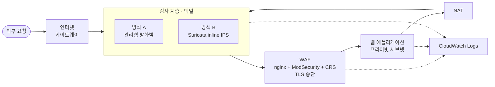

# AWS SOC Lab — Terraform 재구성

2025년 수동으로 구축한 클라우드 보안관제 환경을 코드형 인프라로 재구성한다.
동일 아키텍처를 코드로 재현하면서 원본 구축에서 식별한 결함 16건을 해소한다.

프로젝트의 핵심 과제는 **방화벽 계층을 관리형 방식과 직접 운영 방식으로 각각 구성하고,
동일 요구사항을 만족하는 두 구현의 운영 특성 차이를 실측으로 비교하는 것**이다.

> 이 환경은 프로덕션 아키텍처가 아닌 **검증 환경**이다.
> 계층별 탐지 범위를 관찰하기 위해 의도적으로 유지한 구성이 포함되어 있다.
> 프로덕션 구성과의 차이 및 그 근거는 [`docs/03-architecture.md`](docs/03-architecture.md) 5절에 기술했다.

---

## 재구성 배경

원본 환경은 관리 콘솔에서 수동 구축되었으며, 두 가지 문제를 내포하고 있었다.

**재현성 부재.** 인스턴스 재생성 시 사설 주소가 변경되는데, 해당 주소가 설정 파일에 하드코딩되어
로그 수집 파이프라인이 무증상으로 중단된다. 구성 변경 비용이 높아 환경을 유지하는 것 외의 선택지가 없었다.

**사후 식별된 결함.** 구축 매뉴얼을 재검토하여 결함 16건(`F1`~`F16`)을 식별했다.
가장 심각한 항목은 **웹 방화벽에 규칙 집합이 설치되지 않아 탐지 규칙이 0개**였던 것으로,
as-built 상태는 L7 방어가 아닌 L7 로깅에 해당한다.
전체 목록과 심각도는 [`docs/01-requirements.md`](docs/01-requirements.md) 부록 A에 정리했다.

---

## 아키텍처



두 방식은 동일한 탐지 엔진(Suricata)을 사용하며 양쪽 모두 전량 코드화된다.
엔진과 자동화 수준을 통제 변수로 고정함으로써, 비교 대상은 **운영 부담 · 가용성 · 비용**으로 한정된다.

방식 전환은 라우팅 타깃 3개의 변경으로 이루어지며, 서브넷 구성과 라우팅 구조는 유지된다.

---

## 진행 상황

| Stage | Phase | 상태 |
|---|---|:--:|
| **설계** | 1 요구사항 정의 | ✅ |
| | 2 위협 모델링 | ✅ |
| | 3 아키텍처 설계 · ADR | ✅ |
| **구현** | 4 구현 준비 · 원격 상태 | ✅ |
| | 5 네트워크 | ✅ |
| | 6 웹서버 · 세션 관리자 | ⬜ |
| | 7 WAF · 규칙 집합 | ⬜ |
| | 8 방식 A — 관리형 방화벽 | ⬜ |
| | 9 방식 B — Suricata inline IPS | ⬜ |
| | 10 관측 통합 | ⬜ |
| **검증** | 11 탐지율 측정 · 감사 · 문서화 | ⬜ |

설계 단계를 선행한 것은 구현 착수 후 되돌릴 수 없는 결정을 사전에 확정하기 위함이다.
위협 모델링 과정에서 아웃바운드 검사 요구사항(`FR-10`)의 누락을 식별하여 설계에 반영했다.

---

## 설계 문서

| 문서 | 내용 |
|---|---|
| [`01-requirements.md`](docs/01-requirements.md) | 기능 10 · 비기능 9 · 보안 27 · 인수기준 11, 추적성 매트릭스, 원본 결함 16건 |
| [`02-threat-model.md`](docs/02-threat-model.md) | 신뢰 경계 5개, 위협 43건, 데이터 흐름도, 수용한 위험 |
| [`03-architecture.md`](docs/03-architecture.md) | 상위·상세 설계, 주소 체계, 라우팅, 보안그룹, 로그 파이프라인, 프로덕션 구성과의 차이 |
| [`adr/`](docs/adr/) | 설계 결정 14건. 맥락 · 결정 · 근거 · 고려한 대안 · 결과 |

각 ADR에는 채택하지 않은 선택지와 그 근거를 함께 기록했다.
대안을 검토하지 않은 결정과 검토 후 배제한 결정은 동일하지 않다.

주요 결정 사항:

- [`ADR-007`](docs/adr/007-temporary-credentials.md) — 만료되지 않는 액세스 키를 생성하지 않는다.
  최소 권한 원칙을 적용한 결과 인증 경로 자체가 차단되었으며,
  권한 범위를 확대하는 대신 필요한 액션 2건으로 구성된 정책을 적용하여 해소했다.
- [`ADR-009`](docs/adr/009-nat-before-inspection.md) — 검사 지점 단일화의 대가로
  방화벽 로그의 출발지 주소가 NAT 주소로 통일되는 제약을 수용한다.
- [`ADR-012`](docs/adr/012-inline-ips-fail-close.md) — 검사 프로세스 중단 시 패킷을 차단한다.
  관리형 방식에서는 이 결정 자체가 불가능하며, 이는 공유 책임 모델의 구체적 사례에 해당한다.
- [`ADR-013`](docs/adr/013-default-nacl-sg-only.md) — 네트워크 ACL을 사용하지 않는 근거.

---

## 저장소 구조

```
bootstrap/          상태 저장 버킷. 로컬 상태로 최초 1회 실행
envs/lab/           배포 진입점. 원격 상태 사용
modules/
  network/          VPC · 서브넷 · 라우팅 · 게이트웨이 · 보안그룹
docs/
  adr/              설계 결정 기록
```

`bootstrap/`을 분리한 것은 상태 저장소 생성 시의 순환 의존을 해소하기 위함이다.
상태를 저장할 버킷을 생성하려면 해당 작업의 상태를 기록할 위치가 필요하다.
버킷 생성 코드만 로컬 상태로 운용하고, 이후 모든 구성은 원격 상태를 사용한다.

---

## 실행

```bash
# 1. 상태 저장 버킷 (최초 1회)
cd bootstrap
terraform init && terraform apply

# 2. 배포
cd ../envs/lab
cp backend.hcl.example backend.hcl     # 실제 값으로 채운다
terraform init -backend-config=backend.hcl
terraform plan -out=tfplan
terraform apply tfplan

# 3. 정리
terraform destroy
```

**요구 사항** — Terraform 1.10 이상. S3 네이티브 잠금을 사용하므로 별도 잠금 테이블은 불필요하다.

> Windows PowerShell 환경에서는 `-이름=값` 형태의 인자를 따옴표로 감싸야 한다.
> `terraform init "-backend-config=backend.hcl"`

---

## 비용 운용

상시 기동하지 않으며, 검증이 필요한 시점에만 생성하고 종료 시 삭제한다.

월 예산 상한은 50,000원으로 설정했고, 리소스 생성에 선행하여 예산 알람을 구성했다.
관리형 방화벽 엔드포인트와 NAT 게이트웨이가 시간당 과금 대상이므로,
기동 상태를 유지할 경우 예산을 초과한다.

생성과 삭제를 반복하는 운용 방식은 재현성 요구사항(`NFR-02`)을 매 주기 검증하는 효과를 갖는다.
