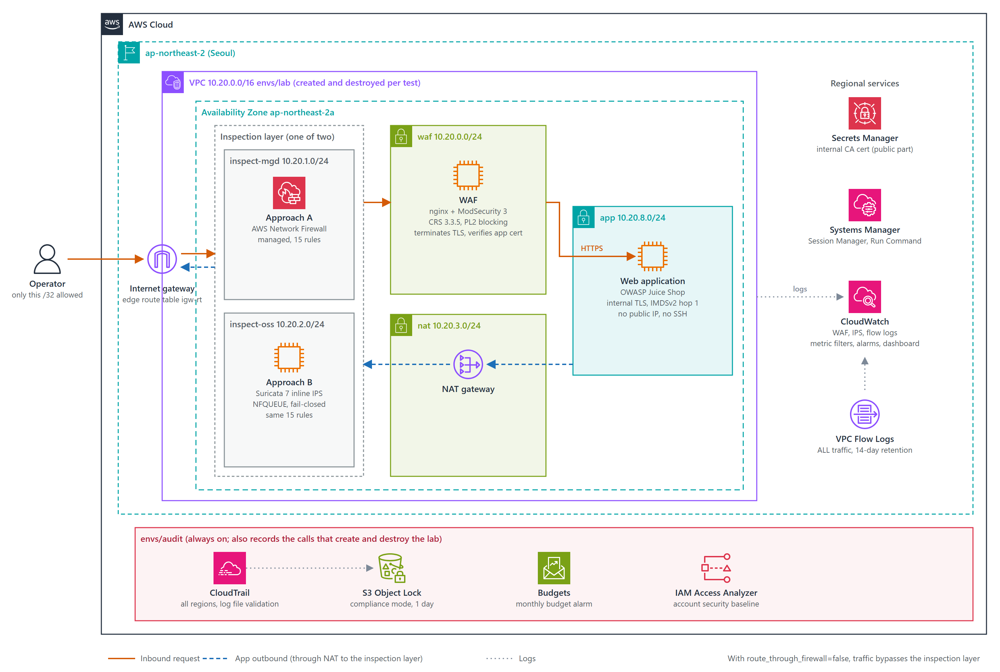
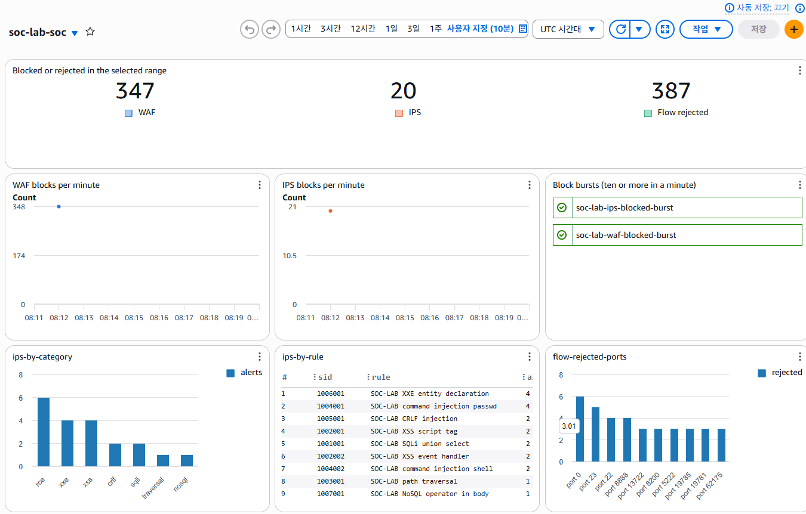

# AWS SOC Lab — Terraform Rebuild

In 2025 I built a cloud security monitoring lab on AWS by hand in the console. This repository rebuilds it in Terraform. Going back through the original build manual, I found 16 defects, and the rebuild fixes them.

The main goal was to build the network inspection layer two ways — managed (AWS Network Firewall) and self-operated (Suricata on EC2) — and measure how two implementations that meet the same requirements differ in practice. The comparison and its conclusion are in [`docs/06-comparison.md`](docs/06-comparison.md).

> This is a test environment, not a production design. Some choices were made on purpose so that each layer's visibility could be observed. How it differs from a production setup, and why, is in [`docs/03-architecture.md`](docs/03-architecture.md) section 5.

## Results at a glance

| Item | Result |
|---|---|
| WAF detection rate | 0% in the original (no rule set installed) → 44.7%. 80.1% on the inputs the app actually reads (query string, JSON body) |
| False positives on real traffic | 0 in every run |
| Two firewall approaches | Same rules blocked 17 and 16 plaintext attacks; they disagreed on 1 request |
| Operations | Managed: ~$0.50/h, 6 min to deploy. Self-operated: ~$0.12/h, 2 min to deploy |
| Acceptance criteria | 11 of 11 met ([`docs/05-verification.md`](docs/05-verification.md)) |
| Requirements | 46 total: 40 met, 4 partial, 2 not implemented (optional and recommended items) |

## Architecture



Inbound requests pass through the internet gateway, then the network inspection layer, then the WAF. The WAF terminates TLS, inspects the request, and forwards it to the app over a second TLS connection. Outbound traffic from the app goes through the NAT gateway and the same inspection layer.

Both approaches run the Suricata engine with the same rule file, so any difference between them comes from the operating model rather than detection logic. A variable selects the approach. The network layout stays the same and only the route targets change. Audit logging lives in a separate, always-on environment, so it also records the calls that create and destroy the lab.

## Key findings

### WAF

The WAF in the original lab had no rule set installed. It had zero detection rules and was only logging requests. I sent the same 618 requests under each configuration: 0% with no rules, 35.0% with CRS at paranoia level 1, and 44.7% at level 2. I enabled blocking at level 2. False positives on real app traffic stayed at 0 throughout.

To count detections even in detect-only mode, I wrote a measurement tool that tags every request with an ID and looks the ID up in each layer's logs ([`ADR-020`](docs/adr/020-in-house-probe-tool.md), [`ADR-021`](docs/adr/021-record-versions-and-paranoia-level.md)).

### What each layer can see

The network inspection layer sits in front of TLS termination. When the same attacks were sent over HTTPS, it caught none of them; every HTTPS attack that was stopped was stopped by the WAF. The one thing only the network layer could do was control outbound traffic from the app server ([`ADR-025`](docs/adr/025-no-firewall-tls-inspection.md)).

### Managed vs. self-operated

Detection was nearly identical. The differences were operational. The managed firewall costs more and takes longer to come up, but AWS handles packet forwarding and failure behavior. The self-operated one is cheaper and faster, but I had to build everything myself, from fail-closed behavior to checking that the engine actually loaded all its rules. In return, its configuration and counters are visible, which made it possible to find the cause when something behaved oddly.

For a lab that is created and destroyed often, self-operated is the better fit. For a service that stays up, managed is ([`docs/06-comparison.md`](docs/06-comparison.md)).

### Logging



The dashboard right after a measurement run with Suricata. It shows block counts from the WAF, the IPS, and VPC flow logs, plus IPS alerts grouped by rule and attack type. Alerts from both approaches use the same field names, so one query reads either ([`ADR-030`](docs/adr/030-collection-point-not-siem.md)). The log agent is installed only after its package signature is verified, and request bodies that carry passwords are dropped before they are logged ([`ADR-028`](docs/adr/028-cloudwatch-agent-signature.md), [`ADR-029`](docs/adr/029-mask-before-logging.md)).

## Verification

| Check | When | What it does |
|---|---|---|
| Secret scan (gitleaks) | Required before merge | Scans the full commit history, with an extra rule for ARNs that contain an account ID |
| Format, validate, module tests | Required before merge | 16 module tests pin decisions such as route switching, exposure, IMDSv2, and encryption |
| IaC security scan (Trivy) | Required before merge | Blocks the merge on HIGH or CRITICAL. The first run found unencrypted root volumes on all three instances |
| Self-audit (Prowler) | After deploy | Fixed 11 account-level findings out of 121 failures and documented the rest ([`docs/04-audit-prowler.md`](docs/04-audit-prowler.md)) |
| Deployment check (`tools/verify`) | After deploy | Runs 12 checks that used to be manual. All 12 pass in about 100 seconds |

CI uses no AWS credentials. It only reads code, so the CI of a public repository never has access to the account ([`ADR-033`](docs/adr/033-ci-security-gates.md)).

## Documents

Design documents and ADRs are written in Korean.

| Document | Contents |
|---|---|
| [`01-requirements.md`](docs/01-requirements.md) | 10 functional, 9 non-functional, 27 security requirements, 11 acceptance criteria, 16 original defects |
| [`02-threat-model.md`](docs/02-threat-model.md) | 5 trust boundaries, 44 threats, data flow diagram, accepted risks |
| [`03-architecture.md`](docs/03-architecture.md) | Addressing, routing, security groups, log pipeline, differences from production |
| [`04-audit-prowler.md`](docs/04-audit-prowler.md) | Self-audit results, fixes, and reasons for accepted findings |
| [`05-verification.md`](docs/05-verification.md) | Acceptance results, traceability matrix for 46 requirements, known gaps |
| [`06-comparison.md`](docs/06-comparison.md) | Comparison of the two approaches and conclusion |
| [`07-operations.md`](docs/07-operations.md) | Deployment order, switching approaches, tool setup, common problems, cost |
| [`adr/`](docs/adr/) | 36 design decisions, each with context, decision, rationale, alternatives, and consequences |

Design (requirements, threat model, architecture) was finished before implementation started. While building the threat model I found that outbound inspection (`FR-10`) was missing from the requirements and added it.

## Repository layout

```
bootstrap/          State bucket. Run once with local state
envs/
  audit/            Always-on audit environment: CloudTrail, locked bucket, budget, account baseline
  lab/              Lab entry point. Created and destroyed as needed
modules/
  network/          VPC, subnets, routing, gateways, security groups
  web/              App instance and internal TLS termination
  waf/              WAF instance and rule set
  secrets/          Secret that carries the internal CA certificate
  firewall_managed/ Approach A: AWS Network Firewall
  firewall_oss/     Approach B: Suricata inline IPS
  observability/    Flow logs, metrics, alarms, dashboard
rules/              Suricata rules shared by both approaches
scripts/            Install scripts shared by the instances
tools/
  probe/            Per-layer detection measurement
  verify/           Deployment verification
docs/               Design documents and ADRs
```

## Quick start

Requires Terraform 1.10+ and AWS CLI v2. First-time setup of the state bucket (`bootstrap/`) and the audit environment (`envs/audit/`), switching to approach B, and tool setup are in [`docs/07-operations.md`](docs/07-operations.md).

```bash
cd envs/lab
cp backend.hcl.example backend.hcl                # fill in the state bucket name
terraform init -backend-config=backend.hcl
terraform apply                                   # approach A; inspection layer only, routes unchanged
terraform apply -var=route_through_firewall=true  # switch routes after confirming management access
terraform destroy -var=route_through_firewall=true
```

Only the public IP of the machine that deployed the lab can reach the WAF. Keep the lab up only while you use it; approach A costs about $0.50 an hour.
