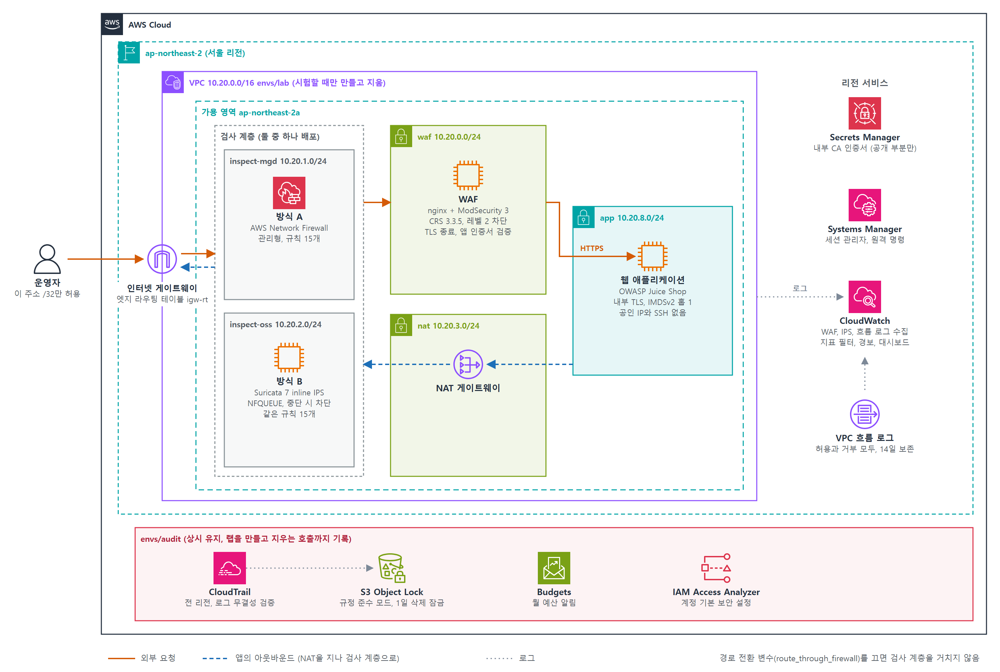
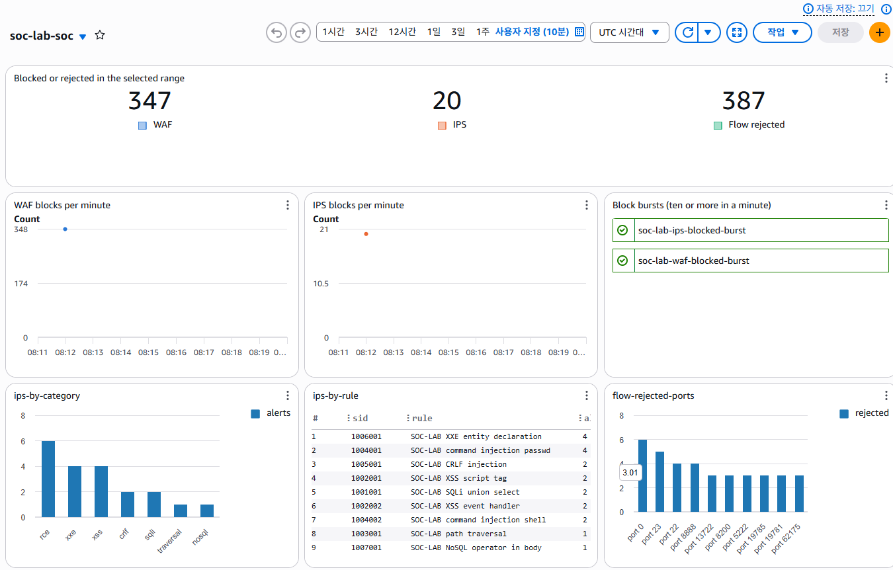

# AWS SOC Lab — Terraform 재구성

2025년에 두 명이서 AWS 콘솔로 직접 구성했던 클라우드 보안관제 실습 환경을, 혼자 Terraform 코드로 다시 만든 저장소다. 원래 구축 매뉴얼을 처음부터 다시 따라가며 재구성 기준에 맞지 않는 부분 16건을 결함으로 정리했고, 재구성에서 모두 고쳤다.

가장 큰 목표는 네트워크 검사 계층을 관리형(AWS Network Firewall)과 직접 운영(EC2 위의 Suricata) 두 가지로 만들어, 같은 요구사항을 만족하는 두 구현이 실제 운영에서 어떻게 다른지 재 보는 것이었다. 비교 결과와 결론은 [`docs/06-comparison.md`](docs/06-comparison.md)에 있다.

> 이 환경은 운영용 설계가 아니라 시험용이다. 계층마다 무엇이 보이는지 관찰하려고 일부러 그렇게 둔 부분이 있다. 운영 환경과 무엇이 다르고 왜 그렇게 했는지는 [`docs/03-architecture.md`](docs/03-architecture.md) 5절에 적었다.

## 결과 요약

| 항목 | 결과 |
|---|---|
| WAF 탐지율 | 원본 0%(규칙 집합 없음) → 44.7%. 앱이 실제로 읽는 입력(질의 문자열, JSON 본문)만 보면 80.1% |
| 실제 사용 흐름 오탐 | 모든 측정에서 0건 |
| 두 방화벽 방식 | 같은 규칙으로 평문 공격 17건을 차단. 관리형은 매번 17건, 직접 운영은 측정 네 번 중 세 번 16건(놓친 요청이 매번 다름, 원인 미확인) |
| 운영 | 관리형은 시간당 약 $0.50, 배포 6분. 직접 운영은 시간당 약 $0.12, 배포 2분 |
| 인수 기준 | 11건 모두 충족([`docs/05-verification.md`](docs/05-verification.md)) |
| 요구사항 | 46건 중 충족 40, 부분 충족 4, 미구현 2(선택과 권장 항목) |

## 구성



들어오는 요청은 인터넷 게이트웨이를 지나 네트워크 검사 계층을 거친 뒤 WAF에 닿는다. WAF가 TLS를 풀어 요청을 검사하고, 다시 TLS로 감싸 앱에 넘긴다. 앱에서 나가는 트래픽도 NAT 게이트웨이를 지나 같은 검사 계층을 거친다.

두 방식 모두 Suricata 엔진에 같은 규칙 파일을 쓰기 때문에, 결과가 다르다면 탐지 로직이 아니라 운영 방식 때문이다. 방식은 변수 하나로 고르고, 네트워크 구성은 그대로 둔 채 라우팅 대상만 바뀐다. 감사 로그는 항상 켜져 있는 별도 환경에 두어서 랩을 만들고 지우는 호출까지 남는다.

## 주요 발견

### WAF

원본 랩의 WAF는 로그 수집을 목적으로 둔 것이라 규칙 집합이 설치되어 있지 않았고, 탐지 규칙은 0개였다. 같은 요청 618개를 설정만 바꿔 보내 보니 규칙이 없을 때 0%, CRS 편집증 수준 1에서 35.0%, 수준 2에서 44.7%가 나왔다. 차단은 수준 2로 켰고, 그동안 실제 앱 트래픽에서 오탐은 한 건도 없었다.

탐지만 하는 모드에서도 탐지 건수를 셀 수 있도록, 요청마다 ID를 붙이고 계층별 로그에서 그 ID를 찾아보는 측정 도구를 직접 만들었다([`ADR-020`](docs/adr/020-in-house-probe-tool.md), [`ADR-021`](docs/adr/021-record-versions-and-paranoia-level.md)).

### 계층마다 보이는 것

네트워크 검사 계층은 TLS가 풀리기 전에 있다. 같은 공격을 HTTPS로 보냈을 때 이 계층은 하나도 잡지 못했고, HTTPS 공격은 모두 WAF에서 막혔다. 네트워크 계층만 할 수 있었던 일은 앱 서버에서 나가는 트래픽을 통제하는 것이었다([`ADR-025`](docs/adr/025-no-firewall-tls-inspection.md)).

### 관리형과 직접 운영

탐지 결과는 거의 같았고, 차이는 운영에서 났다. 관리형은 비싸고 올라오는 데 오래 걸리지만 패킷 전달과 장애 시 동작을 AWS가 맡는다. 직접 운영은 싸고 빠르지만, 검사가 멈추면 트래픽을 막는 동작부터 엔진이 규칙을 전부 읽었는지 확인하는 일까지 모두 직접 만들어야 했다. 대신 설정과 카운터를 볼 수 있어서, 이상하게 동작할 때 원인을 찾을 수 있었다.

자주 만들고 지우는 랩에는 직접 운영이, 계속 떠 있어야 하는 서비스에는 관리형이 맞다([`docs/06-comparison.md`](docs/06-comparison.md)).

### 로그



Suricata 방식으로 측정을 돌린 직후의 대시보드다. WAF, IPS, VPC 흐름 로그의 차단 건수와 IPS 경보를 규칙별, 공격 유형별로 보여 준다. 두 방식의 경보는 필드 이름이 같아서 쿼리 하나로 양쪽을 다 읽을 수 있다([`ADR-030`](docs/adr/030-collection-point-not-siem.md)). 로그 에이전트는 패키지 서명을 확인한 뒤에만 설치하고, 비밀번호가 담긴 요청 본문은 로그에 남기기 전에 버린다([`ADR-028`](docs/adr/028-cloudwatch-agent-signature.md), [`ADR-029`](docs/adr/029-mask-before-logging.md)).

## 검증

| 검사 | 시점 | 내용 |
|---|---|---|
| 비밀값 검사(gitleaks) | 병합 전 필수 | 커밋 이력 전체를 검사. 계정 ID가 들어간 ARN을 잡는 규칙을 따로 추가 |
| 형식, 문법, 모듈 테스트 | 병합 전 필수 | 모듈 테스트 16개로 라우팅 전환, 외부 노출, IMDSv2, 암호화 같은 결정을 고정 |
| IaC 보안 검사(Trivy) | 병합 전 필수 | HIGH나 CRITICAL이 있으면 병합을 막는다. 처음 돌렸을 때 인스턴스 세 대 모두 루트 볼륨이 암호화되지 않은 것을 찾았다 |
| 자체 감사(Prowler) | 배포 후 | 실패 121건 중 계정 단위 11건을 고치고 나머지는 이유를 적어 두었다([`docs/04-audit-prowler.md`](docs/04-audit-prowler.md)) |
| 배포 점검(`tools/verify`) | 배포 후 | 손으로 하던 점검 12개를 한 번에 실행. 약 100초에 12개 모두 통과 |

CI에는 AWS 자격 증명을 넣지 않았다. 코드만 읽기 때문에, 공개 저장소의 CI가 계정에 접근할 길이 아예 없다([`ADR-033`](docs/adr/033-ci-security-gates.md)).

## 문서

| 문서 | 내용 |
|---|---|
| [`01-requirements.md`](docs/01-requirements.md) | 기능 10, 비기능 9, 보안 27개 요구사항, 인수 기준 11건, 원본 결함 16건 |
| [`02-threat-model.md`](docs/02-threat-model.md) | 신뢰 경계 5개, 위협 44건, 데이터 흐름도, 수용한 위험 |
| [`03-architecture.md`](docs/03-architecture.md) | 주소 체계, 라우팅, 보안 그룹, 로그 수집 경로, 운영 환경과 다른 점 |
| [`04-audit-prowler.md`](docs/04-audit-prowler.md) | 자체 감사 결과, 고친 것, 그대로 둔 항목과 그 이유 |
| [`05-verification.md`](docs/05-verification.md) | 인수 기준 판정, 요구사항 46건 추적표, 알려진 빈틈 |
| [`06-comparison.md`](docs/06-comparison.md) | 두 방식 비교와 결론 |
| [`07-operations.md`](docs/07-operations.md) | 배포 순서, 방식 전환, 도구 준비, 자주 막히는 곳, 비용 |
| [`adr/`](docs/adr/) | 설계 결정 36건. 건마다 배경, 결정, 이유, 대안, 결과 |

설계(요구사항, 위협 모델, 구성)는 구현을 시작하기 전에 끝냈다. 위협 모델을 만들다가 요구사항에 아웃바운드 검사(`FR-10`)가 빠져 있다는 것을 알고 추가했다.

## 저장소 구조

```
bootstrap/          상태 버킷. 로컬 상태로 한 번만 실행
envs/
  audit/            항상 켜 두는 감사 환경: CloudTrail, 잠금 버킷, 예산, 계정 기본 설정
  lab/              랩 진입점. 필요할 때 만들고 지운다
modules/
  network/          VPC, 서브넷, 라우팅, 게이트웨이, 보안 그룹
  web/              앱 인스턴스와 내부 TLS 종료
  waf/              WAF 인스턴스와 규칙 집합
  secrets/          내부 CA 인증서를 담는 비밀값
  firewall_managed/ 방식 A: AWS Network Firewall
  firewall_oss/     방식 B: Suricata 인라인 IPS
  observability/    흐름 로그, 메트릭, 경보, 대시보드
rules/              두 방식이 함께 쓰는 Suricata 규칙
scripts/            인스턴스들이 함께 쓰는 설치 스크립트
tools/
  probe/            계층별 탐지 측정
  verify/           배포 점검
docs/               설계 문서와 ADR
```

## 빠른 시작

Terraform 1.10 이상과 AWS CLI v2가 필요하다. 상태 버킷(`bootstrap/`)과 감사 환경(`envs/audit/`)을 처음 만드는 방법, 방식 B로 바꾸는 방법, 도구 준비는 [`docs/07-operations.md`](docs/07-operations.md)에 있다.

```bash
cd envs/lab
cp backend.hcl.example backend.hcl                # 상태 버킷 이름을 채운다
terraform init -backend-config=backend.hcl
terraform apply                                   # 방식 A. 검사 계층만 만들고 라우팅은 그대로
terraform apply -var=route_through_firewall=true  # 관리 접속을 확인한 뒤 라우팅 전환
terraform destroy -var=route_through_firewall=true
```

WAF에는 랩을 배포한 컴퓨터의 공인 IP만 접근할 수 있다. 랩은 쓸 때만 띄워 둔다. 방식 A는 시간당 약 $0.50이 든다.
