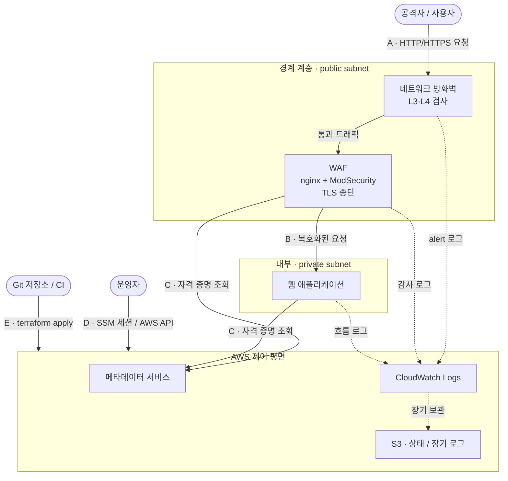

# 위협 모델 — 클라우드 보안관제 환경 (IaC 재구성)

| 항목 | 내용 |
|---|---|
| 문서 ID | `02-threat-model` |
| 버전 | 0.2 (작성 중) |
| 작성일 | 2026-09-01 |
| 상태 | **경계 A·C 완료 · 경계 B·D·E 진행 예정** |
| 방법론 | STRIDE |
| 관련 문서 | `01-requirements.md`, `03-architecture.md`(예정) |

---

## 1. 목적과 범위

### 1.1 목적

`01-requirements.md`의 보안 요구사항(`SR-01`~`SR-16`)은 상당수가 **원본 환경에서 발견된 결함(`F1`~`F16`)에서 역산**한 것이다. 즉 이미 겪은 문제는 반영되어 있으나, **아직 겪지 않은 위협은 누락되어 있을 수 있다.**

이 문서는 신뢰 경계를 나누고 각 경계에 STRIDE 6범주를 기계적으로 대입하여 그 누락을 찾는다. 결과는 두 가지다.

- 기존 보안 요구사항에 **구체적 근거**를 부여한다
- 대응되는 요구사항이 없는 위협에 대해 **새 요구사항을 도출**한다

### 1.2 범위

`01-requirements.md` 2절의 범위를 따른다. 범위에서 제외된 항목(멀티 계정, 컨테이너, 실사용자 트래픽)에 대한 위협은 다루지 않는다.

### 1.3 방법론

STRIDE를 사용한다. 위협을 창의적으로 발상하는 대신 **정해진 6범주를 경계마다 빠짐없이 대입**하는 방식이며, 누락 방지가 목적이다. 해당 없는 조합도 "해당 없음"으로 명시한다.

---

## 2. 자산 식별

보호 가치가 있는 대상이다. 이 환경은 실사용자 데이터를 다루지 않으므로 **자산이 데이터보다 인프라·자격 증명 쪽에 집중**된다.

| ID | 자산 | 분류 | 손실 시 영향 |
|---|---|---|---|
| `AS-01` | 웹 애플리케이션 인스턴스 | 컴퓨팅 | 보호 대상 자체. 침해 시 내부 이동 발판 |
| `AS-02` | WAF 인스턴스 | 컴퓨팅 | 방어 계층 상실 + 경계 계층 장악 발판 |
| `AS-03` | 방화벽 (관리형/직접 운영) | 컴퓨팅 | L3·L4 방어 상실 |
| `AS-04` | **인스턴스 역할의 임시 자격 증명** | 자격 증명 | **AWS 계정 내 권한 획득 경로** |
| `AS-05` | 운영자 자격 증명 | 자격 증명 | 환경 전체 통제권 상실 |
| `AS-06` | **Terraform 상태 파일** | 데이터 | 리소스 구성 전체가 평문. 시크릿 포함 가능 |
| `AS-07` | 보안 로그 (방화벽·WAF·흐름) | 데이터 | 침해 사실 추적 불가 (부인방지 실패) |
| `AS-08` | 탐지 룰셋 | 구성 | 변조 시 방어 무력화, 노출 시 우회 용이 |
| `AS-09` | IaC 코드 저장소 | 구성 | **인프라를 변경할 수 있는 권한과 동등** |
| `AS-10` | **AWS 계정 예산** | 비용 | 소진 시 프로젝트 중단. 클라우드 고유 자산 |

> **`AS-06`과 `AS-10`이 온프레미스에는 없던 자산이다.** 상태 파일은 IaC 도입으로, 예산은 종량 과금 구조로 인해 생겨났다.

---

## 3. 신뢰 경계

신뢰 수준이 바뀌는 지점이다. 경계를 넘는 데이터는 검증 대상이며, 공격은 대부분 이 선을 넘는 형태로 발생한다.

### 경계 A — 인터넷 ↔ 경계 계층

| 항목 | 내용 |
|---|---|
| 바깥 | 인터넷의 모든 출처. 일반 사용자와 공격자가 구분되지 않음 |
| 안쪽 | 네트워크 방화벽, WAF 인스턴스, 탄력적 IP |
| 넘어가는 것 | HTTP/HTTPS 요청 (메서드·URI·헤더·쿠키·본문), TCP 연결 |
| 신뢰 수준 | **0.** 모든 입력이 적대적일 수 있다고 가정 |

### 경계 B — 경계 계층 ↔ 내부 워크로드

| 항목 | 내용 |
|---|---|
| 바깥 | WAF 인스턴스 (퍼블릭 서브넷) |
| 안쪽 | 웹 애플리케이션 (프라이빗 서브넷) |
| 넘어가는 것 | 프록시된 HTTP 요청, 응답 |
| 신뢰 수준 | **중.** WAF를 통과했으나 검사가 완전하지 않음을 전제 |

### 경계 C — 워크로드 ↔ AWS 제어 평면 ★

| 항목 | 내용 |
|---|---|
| 바깥 | EC2 인스턴스 내부에서 실행되는 모든 프로세스 |
| 안쪽 | 인스턴스 메타데이터 서비스, IAM, CloudWatch, S3 |
| 넘어가는 것 | 메타데이터 조회, AWS API 호출, 로그 전송 |
| 신뢰 수준 | **인스턴스 역할이 부여한 권한 범위** |

> **★ 이 경계가 클라우드 위협 모델의 핵심이다.** 온프레미스에는 존재하지 않는다.
> 인스턴스 내부에서 메타데이터 서비스에 접근하면 **인스턴스 역할의 임시 자격 증명(`AS-04`)을 획득**한다.
> 따라서 애플리케이션의 SSRF 취약점 하나가 **AWS 계정 침해로 확대**될 수 있다.
> 네트워크 격리와 권한 격리는 **별개의 축**이며, 프라이빗 서브넷에 있다는 사실이 이 경계를 보호하지 않는다.

### 경계 D — 운영자 ↔ 환경

| 항목 | 내용 |
|---|---|
| 바깥 | 운영자의 단말과 자격 증명 |
| 안쪽 | AWS API, 세션 관리 서비스를 통한 인스턴스 접근 |
| 넘어가는 것 | 인증 요청, 관리 명령, 세션 |
| 신뢰 수준 | **인증된 주체.** 단 단말 침해 시 신뢰 붕괴 |

### 경계 E — 코드 저장소 ↔ 배포

| 항목 | 내용 |
|---|---|
| 바깥 | Git 저장소, CI 파이프라인, 외부 프로바이더·모듈·룰셋 |
| 안쪽 | AWS 계정의 실제 인프라 |
| 넘어가는 것 | Terraform 실행, 외부 의존성 다운로드 |
| 신뢰 수준 | **코드 = 인프라 변경 권한** |

> **IaC 도입으로 새로 생긴 경계다.** 원본의 수동 구축 환경에는 존재하지 않았다.
> 저장소 접근 권한이 곧 인프라 변경 권한이 되며, 외부 의존성(프로바이더·CRS 룰셋)이 공급망 위협 경로가 된다.

---

## 4. 데이터 흐름도



**주요 흐름 세 가지**

| 흐름 | 경로 | 지나는 경계 |
|---|---|---|
| 인바운드 | 인터넷 → 방화벽 → WAF → 웹 애플리케이션 | A, B |
| 로그 | 각 계층 → CloudWatch Logs → S3 | C |
| 관리 | 운영자·CI → AWS API → 인프라 | D, E |

---

## 5. 위험 평가 기준

### 5.1 위험도 산정

가능성과 영향의 조합으로 결정한다. 모든 위협에 동일하게 적용한다.

|  | 영향 하 | 영향 중 | 영향 상 |
|---|---|---|---|
| **가능성 상** | 중 | **상** | **상** |
| **가능성 중** | 하 | 중 | **상** |
| **가능성 하** | 하 | 하 | 중 |

**가능성** — 상: 도구나 특별한 지식 없이 가능 / 중: 일정 수준의 기술 필요 / 하: 선행 침해나 고난도 기법 필요
**영향** — 상: 계정·환경 전체 통제권 상실 또는 프로젝트 중단 / 중: 단일 계층 방어 상실 또는 추적 불가 / 하: 정보 일부 노출

### 5.2 대응 전략

| 전략 | 의미 |
|---|---|
| 완화 | 통제를 적용해 위험을 낮춘다 |
| 수용 | 제약을 근거로 위험을 받아들인다 |
| 전가 | 관리형 서비스 등 제3자에게 책임을 넘긴다 |
| 회피 | 해당 기능·구성을 두지 않는다 |

> 제약(`C-01`~`C-05`)이 존재하는 이상 **모든 위협을 완화할 수 없다.**
> 수용한 위험은 근거와 함께 명시하며, 이는 검토 누락이 아니라 판단의 결과다.

---

## 6. 위협 — 경계 A (인터넷 ↔ 경계 계층)

### 6.1 요약

| ID | 범주 | 위협 | 위험도 | 전략 |
|---|---|---|---|---|
| `T-01` | S 위장 | X-Forwarded-For 헤더 위조 | 상 | 완화 |
| `T-02` | S 위장 | 출발지 IP 스푸핑 | 하 | 수용 |
| `T-03` | T 변조 | 회피 기법을 통한 탐지 룰 우회 | 상 | 완화 |
| `T-04` | T 변조 | 파싱 불일치를 이용한 검사 우회 | 상 | 완화 |
| `T-05` | R 부인 | 출처 오기록으로 인한 추적 실패 | 상 | 완화 |
| `T-06` | R 부인 | Alert 로그만 수집하여 미탐 트래픽 무흔적 | 상 | 완화 |
| `T-07` | R 부인 | 침해된 계정에 의한 로그 삭제 | 중 | 완화 |
| `T-08` | R 부인 | 계층 간 시각 불일치로 상관 분석 불가 | 중 | 완화 |
| `T-09` | I 노출 | 응답 차이를 이용한 룰셋 구조 추론 | 중 | 완화 |
| `T-10` | I 노출 | 응답 헤더·에러 페이지의 시스템 정보 노출 | 중 | 완화 |
| `T-11` | I 노출 | 평문 HTTP 경로를 통한 전송 구간 노출 | 중 | **수용** |
| `T-12` | D 거부 | 인스턴스 자원 고갈 | 중 | 수용 |
| `T-13` | D 거부 | **경제적 서비스 거부 — 비용 증폭** | 상 | 완화 |
| `T-14` | E 상승 | 미패치 경계 소프트웨어를 통한 인스턴스 장악 | 상 | 완화 |

### 6.2 S — 위장

#### `T-01` X-Forwarded-For 헤더 위조

**시나리오**
공격자가 요청에 `X-Forwarded-For: 1.2.3.4`를 직접 넣어 전송한다. WAF의 nginx가 `$proxy_add_x_forwarded_for`로 실제 IP를 **뒤에 덧붙이므로**, 헤더 맨 앞에는 공격자가 심은 값이 남는다. 로그 분석이나 차단 로직이 첫 번째 값을 신뢰하면 실제 출처가 기록되지 않고, 차단이 무관한 제3자 IP에 적용된다.

**근거** 원본 매뉴얼의 nginx 설정에 `proxy_set_header X-Forwarded-For $proxy_add_x_forwarded_for;` 존재
**영향** 부인방지 실패, 차단 통제 무력화, 오차단으로 인한 가용성 저하
**가능성** 상 (헤더 하나 추가) · **영향** 중 · **위험도** 상
**전략** 완화
**통제** 경계에서 수신한 프록시 헤더를 신뢰하지 않고 재작성한다. 로그 기록과 차단 판단은 TCP 연결의 실제 출발지 IP만 사용한다.
**요구사항** `SR-18` (신설)

#### `T-02` 출발지 IP 스푸핑

**시나리오** 공격자가 위조된 출발지 IP로 패킷을 전송해 차단 목록을 우회한다.
**영향** 차단 통제 우회
**가능성** 하 · **영향** 하 · **위험도** 하
**전략** **수용**
**근거** HTTP는 TCP 기반이므로 3-way 핸드셰이크가 성립해야 한다. 출발지를 위조하면 응답을 수신할 수 없어 실질적인 공격이 되지 않는다. 연결 없는 프로토콜을 이용한 증폭 공격은 `T-13`에서 다룬다.

### 6.3 T — 변조

#### `T-03` 회피 기법을 통한 탐지 룰 우회

**시나리오**
공격자가 페이로드를 의미는 유지한 채 표기만 바꿔 전송한다. URL 인코딩(`%53%45%4C%45%43%54`)·이중 인코딩·대소문자 혼용(`SeLeCt`)·주석 삽입(`SEL/**/ECT`)·공백 대체 등을 조합하면, 단순 문자열 매칭 룰은 이를 탐지하지 못한다. 예를 들어 `' OR 1=1--`을 `%27%20oR%201%3D1--`로 변형해 전송한다.

**영향** L7 방어 계층이 무력화되어 SQL 인젝션·XSS 페이로드가 웹 애플리케이션에 그대로 도달한다. 네트워크 방화벽은 이를 정상 HTTP로 판단하므로 **양쪽 계층 모두에서 탐지되지 않는다.**
**가능성** 상 (공개된 우회 페이로드 다수, 자동화 도구 존재) · **영향** 중 · **위험도** 상
**전략** 완화
**통제** 공개 관리 룰셋(OWASP CRS)을 적용한다. CRS는 매칭 이전에 값을 정규화하는 변환 함수 체인(`t:lowercase`, `t:urlDecodeUni`, `t:removeComments` 등)을 포함하며, 개별 룰의 점수를 누적해 임계값 초과 시 차단하는 이상 점수 방식을 사용한다. 파라노이아 레벨을 결정하고 오탐을 튜닝하되 조정 근거를 기록한다.
**요구사항** `SR-11`, `SR-12`

> **원본 환경에서는 이 위협이 100% 성립했다.** CRS가 설치되지 않아 탐지 룰이 0개였으므로(`F1`), 우회를 시도할 필요조차 없이 모든 요청이 통과했다.

#### `T-04` 파싱 불일치를 이용한 검사 우회

**시나리오**
WAF와 웹 애플리케이션이 동일한 요청을 다르게 해석하는 차이를 이용한다.
- **파라미터 오염** — `?id=1&id=2` 전송 시 WAF는 첫 번째 값을, 애플리케이션은 마지막 값을 사용할 수 있다. 악성 페이로드를 두 번째에 배치하면 검사를 우회한다.
- **요청 스머글링** — `Content-Length`와 `Transfer-Encoding`을 동시에 포함시킨다. 프록시와 백엔드가 서로 다른 헤더를 우선하면 요청 경계가 어긋나, 프록시가 하나로 본 요청을 백엔드가 둘로 해석한다. 두 번째 요청은 검사를 전혀 거치지 않는다.

**영향** WAF를 완전히 우회한 요청이 애플리케이션에 도달한다. 룰셋 강화로는 해결되지 않는다.
**가능성** 중 (프로토콜 수준 이해 필요) · **영향** 상 · **위험도** 상
**전략** 완화
**통제** 룰셋이 아니라 프록시 구성 수준에서 대응한다. 모호한 요청(중복 헤더, 상충하는 길이 지정)은 거부하고, 프록시가 요청을 재구성해 백엔드로 전달하도록 한다. WAF와 애플리케이션의 파라미터 처리 방식을 일치시킨다.
**요구사항** ⚠️ 기존 항목으로 완전히 덮이지 않음 — Phase 3 설계에서 프록시 구성 요건으로 반영

### 6.4 R — 부인

부인방지가 성립하려면 세 조건이 모두 필요하다. ① 기록이 존재한다 ② 기록이 정확하다 ③ 기록이 보존·보호된다.

#### `T-05` 출처 오기록으로 인한 추적 실패

**시나리오** `T-01`의 결과로 로그에 기록된 출발지 IP가 실제 공격자가 아니다. 침해 조사 시 잘못된 대상을 추적하게 된다.
**깨지는 조건** ② 정확성
**가능성** 상 · **영향** 중 · **위험도** 상
**전략** 완화 · **통제** `T-01`과 동일 · **요구사항** `SR-18`

#### `T-06` Alert 로그만 수집하여 미탐 트래픽 무흔적

**시나리오**
네트워크 방화벽의 로그 유형은 Alert(룰에 걸린 트래픽)와 Flow(통과한 모든 연결)로 나뉜다. 원본은 Alert만 활성화했으므로, **룰에 걸리지 않은 트래픽은 기록 자체가 없다.** 정찰·스캔·미탐 공격은 방화벽을 통과했다는 사실조차 남지 않는다. `F1`(룰셋 부재)과 결합하면 사실상 대부분의 트래픽이 무기록 상태가 된다.

**근거** 원본 매뉴얼 `로그 유형: Alert`
**깨지는 조건** ① 기록 존재
**가능성** 상 (설정이 유지되는 한 항상 성립) · **영향** 중 · **위험도** 상
**전략** 완화 · **통제** Alert와 Flow 로그를 함께 수집하고, VPC 흐름 로그를 추가한다.
**요구사항** `SR-15` · **관련 결함** `F10`

#### `T-07` 침해된 계정에 의한 로그 삭제

**시나리오** 인스턴스 역할 또는 운영자 자격 증명을 획득한 공격자가 CloudWatch 로그 그룹을 삭제해 침해 흔적을 제거한다. 로그가 공격 대상과 동일한 계정에 보관되므로 격리가 성립하지 않는다.
**깨지는 조건** ③ 보존·보호
**가능성** 하 (선행 침해 필요) · **영향** 상 · **위험도** 중
**전략** 완화
**통제** 단기 로그는 CloudWatch에 14일 보관하고, 이후 S3로 내보내 **Object Lock(Compliance 모드)** 을 적용한다. Compliance 모드는 보존 기간 내에는 루트 권한으로도 삭제할 수 없으므로, 단일 계정 제약(`C-01`) 하에서도 무결성을 확보할 수 있다. 장기 보관 비용도 CloudWatch Logs보다 낮다.
**요구사항** `SR-17` (신설)

#### `T-08` 계층 간 시각 불일치로 상관 분석 불가

**시나리오**
여러 계층의 로그를 하나의 공격 흐름으로 재구성하려면 공통 시간축이 필요하다. 원본은 CloudWatch 에이전트를 UTC로, 방화벽 어플라이언스를 서울 시간대로 설정했다. 두 로그를 나란히 놓으면 **최대 9시간의 순서 왜곡**이 발생해 인과 관계 판단이 불가능해진다.

**근거** 원본 매뉴얼 — 에이전트 설정 `"timezone": "UTC"` / 어플라이언스 초기 설정 `Timezone: Seoul`
**⚠️ 확인 필요** 실제 수집된 로그에서 불일치가 발생했는지는 검증되지 않았다. 설정값 기준의 추정이다.
**깨지는 조건** ② 정확성
**가능성** 중 · **영향** 중 · **위험도** 중
**전략** 완화 · **통제** 전 계층의 시각을 UTC로 통일하고 시각 동기화를 적용한다. 로그 상관 키(출발지 IP 등)를 함께 정의한다.
**요구사항** `SR-19` (신설)

### 6.5 I — 정보 노출

#### `T-09` 응답 차이를 이용한 룰셋 구조 추론

**시나리오**
공격자가 페이로드를 조금씩 변형하며 응답을 관찰한다. 차단 시 403, 백엔드 도달 후 오류 시 500이 반환되면 **어떤 요청이 검사에 걸리고 어떤 요청이 통과하는지 구분**할 수 있다. 특히 500대 응답은 요청이 방어 계층을 통과해 애플리케이션에 도달했다는 신호이므로 공격 방향 설정에 활용된다. 응답 코드뿐 아니라 응답 시간과 본문 길이 차이도 동일한 단서가 된다. 이를 반복하면 룰셋의 탐지 경계를 지도화할 수 있으며, 우회(`T-03`)가 용이해진다.

**영향** 룰셋 구조 노출로 우회 난이도 저하
**가능성** 중 · **영향** 중 · **위험도** 중
**전략** 완화
**통제** 차단 응답을 단일 형태로 통일한다. 어떤 룰에 의해 차단되었든 동일한 상태 코드와 본문을 반환하고, 상세 정보는 로그에만 기록한다.
**요구사항** `SR-20` (신설)

#### `T-10` 응답 헤더·에러 페이지의 시스템 정보 노출

**시나리오**
nginx는 기본 설정에서 `Server: nginx/1.24.0` 형태로 소프트웨어와 버전을 응답에 포함하며, 기본 에러 페이지에도 버전이 표시된다. 공격자는 정찰 단계를 생략하고 해당 버전의 알려진 취약점을 바로 조회할 수 있다. 또한 원본의 `proxy_redirect` 설정에는 공인 IP가 하드코딩되어 리다이렉트 응답에 노출된다.

**근거** 원본 매뉴얼에 `server_tokens off` 설정 부재 / `proxy_redirect http://<공인IP>/ ...` 하드코딩
**가능성** 상 · **영향** 하 · **위험도** 중
**전략** 완화 · **통제** 응답에서 소프트웨어 식별 정보를 제거하고, 사용자 정의 오류 페이지를 사용한다. 리다이렉트 대상을 요청 호스트 기준으로 동적 구성해 주소 하드코딩을 제거한다.
**요구사항** `SR-20` (신설) · **관련 결함** `F16`

#### `T-11` 평문 HTTP 경로를 통한 전송 구간 노출

**시나리오** WAF가 평문 HTTP 포트와 TLS 포트를 동시에 개방한다. 평문 경로로 접속하면 자격 증명을 포함한 요청 내용이 전송 구간에서 노출되며, 다운그레이드 유도도 가능하다.
**가능성** 중 · **영향** 중 · **위험도** 중
**전략** **수용**
**근거**
현행 아키텍처에서 네트워크 방화벽은 TLS 종단 이전에 위치하므로 HTTPS 페이로드를 검사할 수 없다. 따라서 **평문 경로는 계층별 탐지 범위를 실증하기 위한 유일한 검증 수단**이다(동일 페이로드를 HTTP와 HTTPS로 전송해 어느 계층의 로그에 기록되는지 비교). 검증 목적으로 의도적으로 유지한다.
**전제** 운영 환경이라면 HTTPS 리다이렉트와 HSTS를 적용해 제거해야 한다. 이 결정은 랩 환경에 한정된다.

### 6.6 D — 서비스 거부

#### `T-12` 인스턴스 자원 고갈

**시나리오**
대량 요청으로 경계 계층 인스턴스의 자원을 소진시킨다. WAF는 요청마다 다수의 룰을 평가하므로 요청당 CPU 비용이 방화벽보다 크며, 병목이 될 가능성이 높다. 원본은 이 역할에 최소 사양 인스턴스를 사용했다.
추가로 버스터블 인스턴스 계열은 CPU 크레딧을 소진하면 성능이 기저 수준으로 저하된다. **폭주가 아니라 지속적인 중간 강도의 요청만으로도** 성능 저하를 유도할 수 있다.

**방식별 차이** 관리형 방화벽은 처리량이 자동 확장되어 가용성이 유지되는 대신 비용이 증가한다(`T-13`). 직접 운영 방식은 비용이 고정되는 대신 인스턴스 사양에서 병목이 발생한다. **동일한 공격이 운영 모델에 따라 다른 형태의 피해로 나타난다.**

**가능성** 중 · **영향** 중 · **위험도** 중
**전략** **수용** (부분 완화)
**근거** `NFR-05`에서 가용성 이중화를 요구하지 않는다. 랩 환경이며 `NFR-02`(재생성)로 복구 가능하다. 다만 요청 속도 제한은 비용 통제(`T-13`) 목적으로도 필요하므로 함께 적용한다.
**요구사항** `SR-21` (신설)

#### `T-13` 경제적 서비스 거부 — 비용 증폭

**시나리오**
서비스를 중단시키지 않고 **비용만 증가시키는 공격**이다. 관리형 방화벽은 처리 데이터량에 비례해 과금되고, 로그 수집도 용량 기준으로 과금된다. 여기에 원본의 감사 로그 전량 수집 설정(`F12`)이 결합하면 증폭 계수가 커진다.

```
요청 1건 → 방화벽 alert 로그 1건
         → WAF 감사 로그 1건 (요청 전문 포함, 건당 수 KB)
         → IPS 이벤트 로그 1건
```

전량 수집 상태에서는 **유효한 공격일 필요조차 없다.** 정상 형태의 요청을 대량 전송하는 것만으로 로그 비용이 상승한다.

**영향** 월 예산(`NFR-04`) 소진 시 프로젝트 중단. 개인 부담이므로 실질적 피해가 크다.
**가능성** 중 · **영향** 상 · **위험도** 상
**전략** 완화

**통제**
> ⚠️ **예산 알람은 통제가 아니다.** AWS Budgets는 알림만 발송하며 리소스를 중단시키지 않는다. 임계값 초과 후에도 과금은 계속된다.

| 통제 | 내용 |
|---|---|
| 노출 시간 최소화 | 상시 기동하지 않고 필요 시에만 생성·삭제 (이미 채택) |
| 로그 선별 수집 | 전량 수집을 중단하고 관련 트랜잭션만 기록 |
| 요청 속도 제한 | 출발지 기준 요청 빈도 제한 |
| 대응 절차 | 예산 알람 수신 시 즉시 환경을 삭제하는 절차 문서화 |

**요구사항** `SR-16`, `SR-21` (신설) · **관련 결함** `F12`

> `SR-16`(로그 선별 수집)은 비용 최적화 항목으로 도출되었으나, **실제로는 가용성 통제이기도 하다.**

### 6.7 E — 권한 상승

#### `T-14` 미패치 경계 소프트웨어를 통한 인스턴스 장악

**시나리오**
경계 계층에서 인터넷 트래픽을 직접 처리하는 소프트웨어(nginx, ModSecurity) 자체의 취약점을 이용해 원격 코드 실행을 달성하고 WAF 인스턴스를 장악한다. **방어를 위해 배치한 구성 요소가 공격 표면이 되는 구조**다. 인스턴스 장악에 성공하면 다음 단계는 경계 C(메타데이터 서비스를 통한 자격 증명 획득)이다.

**원본 환경의 가중 요인**

| 요인 | 결과 |
|---|---|
| 소스 컴파일 설치 | 패키지 관리자가 존재를 인식하지 못해 **보안 업데이트가 적용되지 않는다** |
| 취약점 스캔 누락 | 스캐너는 패키지 목록 기준으로 판단하므로 **취약점 없음으로 오보고**된다 |
| 버전 미고정 | `git clone`에 버전 태그가 없어 빌드 시점마다 다른 코드가 설치된다. 어떤 버전이 동작 중인지 특정할 수 없어 취약점 대응이 불가능하다 |
| 모듈 ABI 종속 | 수동 빌드한 모듈이 특정 웹서버 버전에 묶여, **웹서버를 패치하면 모듈이 동작하지 않는다.** 결과적으로 패치를 회피하게 된다 |

**근거** 원본 매뉴얼 — `git clone --recursive https://github.com/owasp-modsecurity/ModSecurity` (버전 태그 없음), 소스 빌드 후 `make install`
**가능성** 중 · **영향** 상 (인스턴스 장악 후 경계 C로 확대) · **위험도** 상
**전략** 완화

**통제**

| 통제 | 연결 |
|---|---|
| 배포판 패키지로 설치하고 버전을 고정한다 | `NFR-07` (확정) |
| 자동 보안 업데이트를 적용한다 | `SR-22` (신설) |
| 인스턴스를 불변 자원으로 취급하고 주기적으로 재생성한다 | up/down 사이클이 부수적으로 달성 |
| 경계 계층 인스턴스의 권한을 최소화해 장악 시 확산을 제한한다 | `SR-06` |

**관련 결함** `F11`

> 비용 절감을 위해 채택한 up/down 사이클이 **패치 관리에도 기여**한다. 매 기동 시 최신 패키지로 부팅되므로 불변 인프라의 이점을 얻는다.

---

## 7. 위협 — 경계 C (워크로드 ↔ AWS 제어 평면)

### 7.1 이 경계의 특수성

온프레미스 환경에는 존재하지 않는 경계다. **인스턴스가 자신의 권한을 스스로 보유**하며, 그 권한은 인스턴스 내부에서 별도 인증 없이 조회된다.

```
웹 애플리케이션의 SSRF 취약점
  → 메타데이터 서비스(169.254.169.254) 호출
  → 인스턴스 역할의 임시 자격 증명 획득
  → AWS API 호출
  → 계정 내 리소스 조작
```

**웹 애플리케이션 취약점 하나가 계정 침해로 확대되는 경로다.**

#### 네트워크 통제가 적용되지 않는다

메타데이터 서비스 주소 `169.254.169.254`는 링크 로컬 대역(RFC 3927)에 속한다. 이 트래픽은 **네트워크 인터페이스를 벗어나지 않으므로 보안그룹과 네트워크 ACL의 검사 대상이 아니다.**

따라서 이 경계는 네트워크 격리로 보호할 수 없으며, 다음 세 가지에만 의존한다.

| 통제 | 요구사항 |
|---|---|
| 메타데이터 서비스의 세션 토큰 방식 강제 | `SR-02` |
| 메타데이터 응답 홉 제한 최소화 | `SR-02` (보강) |
| 인스턴스 역할 권한 최소화 | `SR-06`, `SR-07` |

> **프라이빗 서브넷에 위치한다는 사실은 이 경계를 보호하지 않는다.** 네트워크 격리와 권한 격리는 별개의 축이다.

### 7.2 요약

| ID | 범주 | 위협 | 위험도 | 전략 |
|---|---|---|---|---|
| `T-15` | S 위장 | 탈취한 자격 증명으로 정당한 워크로드 위장 | 상 | 완화 |
| `T-16` | T 변조 | 과도한 권한을 이용한 로그 위조 주입 | 중 | 완화 |
| `T-17` | T 변조 | 상태 파일 변조를 통한 인프라 변경 유도 | 중 | 완화 |
| `T-18` | R 부인 | **API 호출 감사 기록 부재** | 상 | 완화 |
| `T-19` | R 부인 | 역할 공유로 인한 행위 주체 식별 불가 | 중 | 완화 |
| `T-20` | I 노출 | **SSRF를 통한 자격 증명 노출** | 상 | 완화 |
| `T-21` | I 노출 | 인스턴스 사용자 데이터의 시크릿 노출 | 상 | 완화 |
| `T-22` | I 노출 | 상태 파일의 평문 정보 노출 | 중 | 완화 |
| `T-23` | D 거부 | 로그 전송 실패로 인한 기록 유실 | 중 | 수용 |
| `T-24` | E 상승 | 과도한 인스턴스 역할 권한을 통한 확산 | 상 | 완화 |

### 7.3 S — 위장

#### `T-15` 탈취한 자격 증명으로 정당한 워크로드 위장

**시나리오**
공격자가 메타데이터 서비스에서 인스턴스 역할의 임시 자격 증명을 획득한다. **이 자격 증명은 인스턴스에 바인딩되지 않으므로, 공격자는 자신의 환경에서 그대로 사용해 AWS API를 호출할 수 있다.** 만료 시점까지 유효하다.

결과적으로 다음이 성립한다.
- 서버에 지속적인 침입 흔적을 남기지 않고도 계정을 조작할 수 있다
- 인스턴스를 종료해도 자격 증명은 만료 전까지 유효하다
- **네트워크 차단으로 대응할 수 없다.** 공격자는 이미 외부에 있다

**가능성** 중 (선행 취약점 필요) · **영향** 상 · **위험도** 상
**전략** 완화
**통제** 자격 증명 획득 경로를 차단한다(`T-20`). 권한을 최소화해 탈취 시 가용 범위를 제한한다(`T-24`). 자격 증명이 예상 밖 출처에서 사용되는 것을 탐지할 수 있어야 한다.
**요구사항** `SR-02`, `SR-06`, `SR-23` (신설)

### 7.4 T — 변조

#### `T-16` 과도한 권한을 이용한 로그 위조 주입

**시나리오**
로그 전송용 역할에 AWS 관리형 정책을 그대로 부여하면, 허용 리소스 범위가 전체(`*`)가 된다. 의도는 "이 인스턴스가 자기 로그 그룹에 기록"이지만 실제로는 **계정의 모든 로그 그룹에 기록**할 수 있다.

공격자는 이 권한으로 다른 계층의 로그 그룹에 조작된 기록을 주입해 조사를 오염시킬 수 있다. 경계 A의 부인방지 문제(`T-05`~`T-08`)가 제어 평면에서 반복된다.

**근거** 원본 매뉴얼은 역할 이름(`EC2_CloudwatchLogs_role`)만 기록하고 정책 내용을 남기지 않았다. ⚠️ 실제 부여된 정책은 확인되지 않았다.
**가능성** 중 · **영향** 중 · **위험도** 중
**전략** 완화
**통제** 관리형 정책을 사용하지 않고, 허용 작업을 로그 스트림 생성·기록으로 한정하며 대상 리소스를 해당 로그 그룹의 ARN으로 지정한다.
**요구사항** `SR-06`

#### `T-17` 상태 파일 변조를 통한 인프라 변경 유도

**시나리오**
Terraform 상태 파일(`AS-06`)에 접근 권한을 얻은 공격자가 내용을 조작한다. 상태는 실제 인프라와 코드를 대조하는 기준이므로, 변조된 상태에서 다음 적용이 실행되면 **의도하지 않은 리소스 변경이나 삭제**가 발생한다. 코드 저장소를 건드리지 않고도 인프라를 바꿀 수 있다.

**가능성** 하 (상태 저장소 접근 권한 필요) · **영향** 상 · **위험도** 중
**전략** 완화
**통제** 상태 저장소에 버전 관리를 적용해 변조 시 복구 가능하게 하고, 접근 권한을 운영자로 한정한다. 저장 시 암호화한다.
**요구사항** `SR-09`

### 7.5 R — 부인

#### `T-18` API 호출 감사 기록 부재

**시나리오**
제어 평면에서 발생한 행위는 네트워크 로그나 애플리케이션 로그에 남지 않는다. **AWS API 호출 기록을 별도로 수집하지 않으면, 탈취된 자격 증명으로 무엇을 했는지 확인할 방법이 없다.** 리소스가 삭제되었는지, 설정이 변경되었는지, 어떤 데이터가 조회되었는지 전부 추적 불가능하다.

**근거** 원본 매뉴얼 전체에 감사 로깅 서비스에 대한 언급이 없다.
**가능성** 상 (수집을 설정하지 않는 한 항상 성립) · **영향** 중 · **위험도** 상
**전략** 완화

**통제**
경계 A의 `T-07`과 동일한 구조적 문제가 있다 — **침해된 계정은 감사 로그도 중단시킬 수 있다.** 따라서 두 겹으로 구성한다.

| 계층 | 내용 |
|---|---|
| 수집 | 모든 AWS API 호출을 감사 로그로 기록 |
| 무결성 | 로그 파일 무결성 검증 기능을 활성화해 사후 변조를 탐지 |
| 보존 | `SR-17`과 동일하게 삭제 방지를 적용 |

**요구사항** `SR-23` (신설)

#### `T-19` 역할 공유로 인한 행위 주체 식별 불가

**시나리오**
여러 인스턴스가 하나의 역할을 공유하면, 감사 로그에 기록되는 주체가 동일해 **어느 인스턴스에서 발생한 행위인지 구분할 수 없다.** 또한 한 인스턴스가 침해되면 다른 인스턴스의 권한도 동일하게 획득된다.

**근거** 원본 매뉴얼 — WAF 인스턴스와 방화벽 어플라이언스가 `EC2_CloudwatchLogs_role`을 공유
**가능성** 상 · **영향** 하 · **위험도** 중
**전략** 완화 · **통제** 워크로드별로 역할을 분리하고, 각 역할에 해당 워크로드가 필요로 하는 권한만 부여한다.
**요구사항** `SR-07`

### 7.6 I — 정보 노출

#### `T-20` SSRF를 통한 자격 증명 노출

**시나리오**
웹 애플리케이션에 사용자가 지정한 주소로 서버가 요청을 수행하는 기능이 있으면(이미지 가져오기, 링크 미리보기, 웹훅 등록, 문서 변환 등), 공격자는 그 주소를 메타데이터 서비스로 지정한다.

```
정상  사용자 입력: https://example.com/image.jpg
      → 서버가 해당 주소에 요청 → 응답을 화면에 표시

공격  공격자 입력: http://169.254.169.254/latest/meta-data/iam/security-credentials/
      → 서버가 자신의 메타데이터에 요청 → 자격 증명이 화면에 표시
```

공격자는 해당 주소에 직접 접근할 수 없지만, **접근 가능한 서버에 요청을 대행시킴으로써** 우회한다.

**영향** 인스턴스 역할의 임시 자격 증명 유출. 이후 `T-15`, `T-24`로 연결된다.
**가능성** 중 · **영향** 상 · **위험도** 상
**전략** 완화

**통제**

| 통제 | 근거 |
|---|---|
| **메타데이터 세션 토큰 방식 강제** | 조회 전에 별도 메서드로 토큰을 발급받도록 요구한다. 일반적인 SSRF는 단순 조회 요청만 생성할 수 있으므로 이 절차를 만족시키기 어렵다 |
| 응답 홉 제한 최소화 | 인스턴스 자신 외의 경로에서 접근할 수 없도록 한다 |
| 애플리케이션 단 주소 검증 | 사설·링크 로컬 대역으로의 요청을 거부한다 |

> **네트워크 통제는 이 위협에 적용되지 않는다.** 7.1절 참조.

**요구사항** `SR-02` (보강 — 홉 제한 명시)

#### `T-21` 인스턴스 사용자 데이터의 시크릿 노출

**시나리오**
인스턴스 초기 구성 스크립트(사용자 데이터)는 **메타데이터 서비스를 통해 조회 가능하다.** 여기에 자격 증명·키·토큰을 직접 기입하면, 메타데이터에 접근할 수 있는 모든 주체가 이를 읽을 수 있다. `T-20`의 SSRF 경로로도 노출된다.

IaC 전환 과정에서 초기 구성을 자동화하면서 발생하기 쉬운 문제다. 원본은 수동 구성이었으므로 해당 사항이 없었으나, **재구성에서 새로 생기는 위험**이다.

**가능성** 중 · **영향** 상 · **위험도** 상
**전략** 완화 · **통제** 사용자 데이터에 시크릿을 포함하지 않는다. 필요한 값은 전용 비밀 관리 서비스에서 실행 시점에 조회하며, 조회 권한은 해당 인스턴스 역할로 한정한다.
**요구사항** `SR-24` (신설)

#### `T-22` 상태 파일의 평문 정보 노출

**시나리오** Terraform 상태 파일에는 생성된 리소스의 속성이 평문으로 기록된다. 리소스 식별자, 네트워크 구성, 경우에 따라 시크릿까지 포함될 수 있다. 저장소가 노출되면 환경 전체 구조가 드러난다.
**가능성** 하 · **영향** 상 · **위험도** 중
**전략** 완화 · **통제** 상태 저장소를 비공개로 유지하고 저장 시 암호화한다. 접근 권한을 운영자로 한정한다. 상태 파일을 코드 저장소에 포함하지 않는다.
**요구사항** `SR-09`, `SR-10`

### 7.7 D — 서비스 거부

#### `T-23` 로그 전송 실패로 인한 기록 유실

**시나리오** 대량 이벤트 발생 시 로그 전송이 API 제한에 걸리거나 에이전트가 처리량을 따라가지 못해 기록이 유실된다. 공격이 집중된 시점의 로그가 오히려 남지 않는 결과가 된다. 부인방지(`T-18`)와 연결된다.
**가능성** 중 · **영향** 중 · **위험도** 중
**전략** **수용** (부분 완화)
**근거** `NFR-05`에서 가용성 이중화를 요구하지 않는다. 다만 `SR-16`(로그 선별 수집)을 적용하면 전송량 자체가 줄어 발생 가능성이 낮아진다.

### 7.8 E — 권한 상승

#### `T-24` 과도한 인스턴스 역할 권한을 통한 확산

**시나리오**
`T-20`으로 자격 증명을 획득한 공격자가 그 권한 범위 내에서 계정 리소스를 조작한다. **피해 범위는 전적으로 해당 역할에 부여된 권한에 의해 결정된다.** 권한이 넓을수록 단일 취약점의 결과가 커진다.

권한이 과도할 경우 가능한 행위의 예시는 다음과 같다.
- 다른 로그 그룹 조작 (`T-16`)
- 보안그룹·라우팅 변경으로 내부 접근 경로 개설
- 다른 역할로의 전환을 통한 추가 권한 획득
- 저장소 접근을 통한 데이터 조회

**가능성** 중 · **영향** 상 · **위험도** 상
**전략** 완화

**통제**

| 통제 | 내용 |
|---|---|
| 최소 권한 | 작업과 대상 리소스를 필요한 범위로 한정한다. 관리형 정책을 그대로 부여하지 않는다 |
| 역할 분리 | 워크로드별로 역할을 분리해 침해 시 확산을 제한한다 |
| 권한 상승 경로 차단 | 인스턴스 역할이 다른 역할로 전환하거나 정책을 수정할 수 없도록 한다 |
| 탐지 | API 호출 감사 기록으로 비정상 행위를 확인할 수 있게 한다 |

**요구사항** `SR-06`, `SR-07`, `SR-23` (신설)

---

## 8. 위협 — 경계 B · D · E

**작성 예정.** 경계 A·C에서 확립한 형식을 동일하게 적용한다.

| 경계 | 상태 | 예상 주요 위협 |
|---|---|---|
| B — 경계 계층 ↔ 내부 | 미작성 | 검사 우회 요청의 내부 도달, 내부 구간 암호화 미비, 경계 계층 장악 후 측면 이동 |
| D — 운영자 ↔ 환경 | 미작성 | 운영자 자격 증명 유출, 관리 행위 추적, 단말 침해 |
| E — 저장소 ↔ 배포 | 미작성 | 코드 변조를 통한 인프라 변경, 외부 의존성 공급망, 파이프라인 권한 |

## 9. 도출된 신규 보안 요구사항

경계 A·C 분석 결과 기존 요구사항으로 대응되지 않는 통제가 확인되었다. `01-requirements.md`에 반영한다.

| ID | 요구사항 | 출처 위협 |
|---|---|---|
| `SR-17` | 보안 로그는 삭제·변조로부터 보호되어야 하며, 계정 권한을 가진 주체도 보존 기간 내에는 삭제할 수 없어야 한다 | `T-07` |
| `SR-18` | 경계 계층에서 수신한 프록시 관련 헤더를 신뢰하지 않아야 하며, 출처 판단은 실제 연결 정보를 기준으로 한다 | `T-01`, `T-05` |
| `SR-19` | 모든 구성 요소의 시각은 협정 세계시로 통일하고 동기화되어야 한다 | `T-08` |
| `SR-20` | 응답은 시스템 구성과 탐지 로직에 관한 정보를 노출하지 않아야 한다 | `T-09`, `T-10` |
| `SR-21` | 출발지 기준 요청 속도를 제한할 수 있어야 한다 | `T-12`, `T-13` |
| `SR-22` | 보안 소프트웨어는 보안 업데이트를 지속적으로 수신할 수 있는 방식으로 설치·운영되어야 한다 | `T-14` |
| `SR-23` | AWS API 호출은 **감사 로그로 기록**되어야 하며, 그 **무결성을 검증**할 수 있어야 한다 | `T-15`, `T-18`, `T-24` |
| `SR-24` | 시크릿은 **인스턴스 사용자 데이터·코드·상태 파일에 평문으로 포함되지 않아야** 하며, 실행 시점에 전용 관리 수단에서 조회되어야 한다 | `T-21` |

**기존 요구사항 보강** — `SR-02`에 **메타데이터 응답 홉 제한을 최소값으로 설정**할 것을 명시한다 (`T-20`).

**설계 단계로 이월** — `T-04`(파싱 불일치)는 룰셋이 아닌 프록시 구성 수준의 대응이 필요하므로, `03-architecture.md`에서 프록시 요건으로 다룬다.

---

## 10. 수용한 위험

| ID | 위험 | 수용 근거 |
|---|---|---|
| `T-02` | 출발지 IP 스푸핑 | TCP 핸드셰이크 특성상 실질적 공격이 성립하지 않는다 |
| `T-11` | 평문 HTTP 경로 노출 | 계층별 탐지 범위 실증을 위한 검증 수단으로 의도적으로 유지한다. 운영 환경에는 적용하지 않는다 |
| `T-12` | 인스턴스 자원 고갈 | `NFR-05`에서 가용성 이중화를 요구하지 않으며, `NFR-02`(재생성)로 복구 가능하다 |
| `T-23` | 로그 전송 실패로 인한 기록 유실 | `NFR-05` 동일. `SR-16`(선별 수집)으로 발생 가능성을 낮춘다 |

---

## 11. 미확인 항목

| 항목 | 내용 |
|---|---|
| `T-08` | 계층 간 시각 불일치가 실제 로그에서 발생했는지 미검증. 설정값 기준 추정 |
| 방식별 자원 한계 | `T-12`에서 어느 구성 요소가 먼저 병목이 되는지 실측 필요. Phase 11 검증 대상 |
| `T-16` | 원본에서 실제로 부여된 IAM 정책 내용이 매뉴얼에 기록되지 않아 확인 불가. 역할 이름만 남아 있다 |

---

## 변경 이력

| 버전 | 일자 | 내용 |
|---|---|---|
| 0.1 | 2026-09-01 | 최초 작성 — 자산 식별, 신뢰 경계 A~E 정의, 데이터 흐름도, 위험 평가 기준, 경계 A 위협 14건 |
| 0.2 | 2026-09-01 | 경계 C 위협 10건(`T-15`~`T-24`) 추가. 신규 요구사항 `SR-23`·`SR-24` 도출, `SR-02` 보강 |
