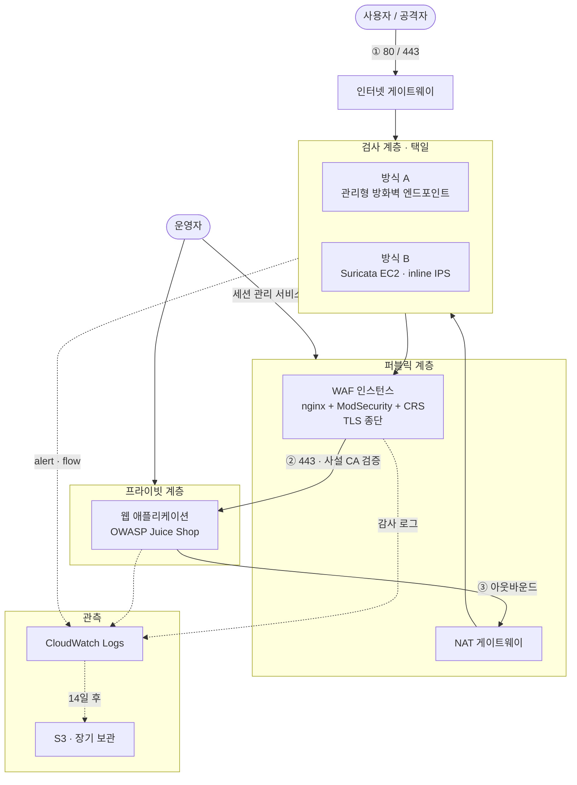

# 아키텍처 설계 — 클라우드 보안관제 환경 (IaC 재구성)

| 항목 | 내용 |
|---|---|
| 문서 ID | `03-architecture` |
| 버전 | 1.0 |
| 작성일 | 2026-09-02 |
| 상태 | 설계 승인 대기 |
| 관련 문서 | `01-requirements.md`, `02-threat-model.md`, `adr/` |

---

## 1. 개요

### 1.1 이 문서의 성격

`01-requirements.md`의 요구사항과 `02-threat-model.md`의 위협에 대응하는 구조를 정의한다.
설계 결정의 근거는 `adr/` 디렉토리에 개별 기록한다.

### 1.2 ⚠️ 이 환경은 프로덕션 아키텍처가 아니다

**두 운영 모델을 비교하기 위한 검증 환경이다.** 프로덕션이라면 다음이 표준이다.

| 계층 | 프로덕션 표준 | 이 환경 |
|---|---|---|
| 인바운드 웹 방어 | 로드밸런서 + 관리형 WAF | **nginx + ModSecurity on EC2** |
| 네트워크 검사 | 관리형 방화벽 (아웃바운드·동서 중심) | 관리형 / **직접 운영** 두 방식 |
| 직접 운영 검사 계층 | Gateway Load Balancer + 오토스케일링 | **EC2 단일 인스턴스** |

**의도적인 선택이다.** 직접 구축해야 관리형이 무엇을 대신해주는지 측정할 수 있고,
그 측정이 `FR-04`(두 방식 비교)의 목적이다. 프로덕션 권장 구성은 5절에 정리한다.

### 1.3 설계 원칙

| 원칙 | 근거 |
|---|---|
| 인터넷 직접 도달 자산을 경계 계층으로 한정 | `SR-03` |
| 접근 통제는 보안그룹 참조 방식으로 | `SR-04` |
| 관리 접근은 세션 관리 서비스로만 | `SR-01` |
| 모든 계층 로그를 단일 지점으로 수집 | `FR-05` |
| 가용영역 수를 변수로 받아 확장 가능 | `NFR-05` |

---

## 2. HLD — 상위 설계

### 2.1 논리 구성도



### 2.2 트래픽 흐름

| # | 흐름 | 경로 |
|---|---|---|
| ① | 인바운드 | 사용자 → IGW → **검사 계층** → WAF → 앱 |
| ② | 응답 | 앱 → WAF → **검사 계층** → IGW → 사용자 |
| ③ | 앱 아웃바운드 | 앱 → NAT → **검사 계층** → IGW |
| ④ | ③의 응답 | IGW → **검사 계층** → NAT → 앱 |
| ⑤ | 로그 | 각 계층 → CloudWatch Logs → S3 |
| ⑥ | 관리 | 운영자 → 세션 관리 서비스 → 인스턴스 |

**①②가 대칭, ③④가 대칭이다.** 상태 저장 방화벽은 연결의 양방향을 모두 관측해야 하므로
각 쌍이 동일한 검사 지점을 지나야 한다.

### 2.3 요구사항 대응

| 요구사항 | 구성 요소 |
|---|---|
| `FR-01` 웹 서비스 제공 | WAF 인스턴스(진입점) + 웹 애플리케이션 |
| `FR-02` 네트워크 공격 탐지·차단 | 검사 계층 (양 방식 공통) |
| `FR-03` 웹 공격 탐지·차단 | ModSecurity + OWASP CRS |
| `FR-04` 두 방식 구성·전환 | 라우팅 타깃 3개 변경 (4절) |
| `FR-05` 로그 단일 수집 | CloudWatch Logs |
| `FR-06` 조회·시각화 | CloudWatch 대시보드 + Logs Insights |
| `FR-08` 공격 재현·검증 | 검증 스크립트 (Phase 11) |
| `FR-09` 생성·삭제 | Terraform |
| `FR-10` 아웃바운드 검사 | 검사 계층 (③ 경로) |

---

## 3. LLD — 상세 설계

### 3.1 CIDR 및 서브넷

**VPC `10.20.0.0/16`** — 대역 선택 근거는 `ADR-010`.

가용영역별로 `/20` 블록을 먼저 배정하고 그 안에서 용도별로 분할한다.
`NFR-05`(AZ 수 변수화)를 만족하기 위한 구조다.

```
AZ-a   10.20.0.0/20     ← 이번 배포
AZ-b   10.20.16.0/20    ← 변수 변경만으로 동일 구조 생성
AZ-c   10.20.32.0/20
```

#### AZ-a 서브넷

| CIDR | 이름 | 성격 | 배치 |
|---|---|---|---|
| `10.20.0.0/24` | `waf` | public | WAF 인스턴스 + 탄력적 IP |
| `10.20.1.0/24` | `inspect-mgd` | — | 관리형 방화벽 엔드포인트 (방식 A) |
| `10.20.2.0/24` | `inspect-oss` | — | Suricata 인스턴스 (방식 B) |
| `10.20.3.0/24` | `nat` | public | NAT 게이트웨이 |
| `10.20.8.0/24` | `app` | **private** | 웹 애플리케이션 |

> 서브넷당 사용 가능 주소는 251개다. 처음 4개와 마지막 1개는 AWS가 예약한다.

### 3.2 라우팅 테이블

모든 테이블에 `10.20.0.0/16 → local`이 자동 포함되므로 아래에서는 생략한다.

#### 방식 A — 관리형 방화벽

| 테이블 | 연결 | 대상 | 타깃 |
|---|---|---|---|
| `igw-rt` | **엣지 연결 → IGW** | `10.20.0.0/24` | 방화벽 엔드포인트 |
| | | `10.20.3.0/24` | 방화벽 엔드포인트 |
| `waf-rt` | 서브넷 `waf` | `0.0.0.0/0` | 방화벽 엔드포인트 |
| `inspect-rt` | 서브넷 `inspect-mgd` | `0.0.0.0/0` | 인터넷 게이트웨이 |
| `app-rt` | 서브넷 `app` | `0.0.0.0/0` | NAT 게이트웨이 |
| `nat-rt` | 서브넷 `nat` | `0.0.0.0/0` | 방화벽 엔드포인트 |

#### 방식 B — 직접 운영

**타깃만 바뀐다.** 구조는 동일하다.

| 테이블 | 대상 | 타깃 |
|---|---|---|
| `igw-rt` | `10.20.0.0/24`, `10.20.3.0/24` | **Suricata 인스턴스 ENI** |
| `waf-rt` | `0.0.0.0/0` | **Suricata 인스턴스 ENI** |
| `inspect-rt` | `0.0.0.0/0` | 인터넷 게이트웨이 *(연결 서브넷은 `inspect-oss`)* |
| `app-rt` | `0.0.0.0/0` | NAT 게이트웨이 |
| `nat-rt` | `0.0.0.0/0` | **Suricata 인스턴스 ENI** |

#### 엣지 연결에 대하여

`igw-rt`만 **게이트웨이에 연결**한다. 나머지는 서브넷에 연결한다.

| 연결 방식 | 적용 대상 |
|---|---|
| 서브넷 연결 | 그 서브넷에서 **나가는** 트래픽 |
| **엣지 연결** | 게이트웨이로 **들어오는** 트래픽 |

서브넷 연결만으로는 인바운드 경로를 통제할 수 없다. 인터넷에서 들어온 패킷은
목적지 서브넷으로 직행하므로, 중간에 검사 계층을 넣으려면 엣지 연결이 필요하다.

> ⚠️ **Phase 8 착수 시 실제 배포로 재검증한다.** 특히 엣지 연결 동작과
> 인바운드·아웃바운드 경로의 대칭성은 실물 트래픽 확인 전까지 검증되지 않은 설계다.

### 3.3 보안그룹

보안그룹은 **상태 저장**이므로 허용된 연결의 응답은 반대 방향 규칙 없이 통과한다.

> ⚠️ Terraform에서 아웃바운드 규칙을 명시하지 않으면 **전체 차단**된다.
> 콘솔 생성 시 자동으로 붙는 전체 허용 규칙이 코드에서는 생성되지 않는다.

#### `waf-sg` — WAF 인스턴스

| 방향 | 대상 | 포트 | 근거 |
|---|---|---|---|
| 인바운드 | `0.0.0.0/0` | 443 | `FR-01` |
| 인바운드 | `0.0.0.0/0` | 80 | `T-11` 계층별 탐지 범위 검증용 (의도적 유지) |
| 아웃바운드 | `app-sg` | 443 | `SR-08` 내부 구간 암호화 |
| 아웃바운드 | `0.0.0.0/0` | 443 | 세션 관리 서비스 · 패치 |

#### `app-sg` — 웹 애플리케이션

| 방향 | 대상 | 포트 | 근거 |
|---|---|---|---|
| 인바운드 | **`waf-sg`** | 443 | `SR-03`, `SR-04` |
| 아웃바운드 | `0.0.0.0/0` | 443 | 세션 관리 서비스 · 패키지 |
| 아웃바운드 | `0.0.0.0/0` | 80 | ⚠️ 패키지 저장소. 5.2절 참고 |

**인바운드가 한 줄뿐이다.** WAF 외에는 어떤 주체도 애플리케이션에 접근할 수 없다.

#### `suricata-sg` — 방식 B 검사 인스턴스

| 방향 | 대상 | 포트 | 근거 |
|---|---|---|---|
| 인바운드 | `0.0.0.0/0` | 80, 443 | 통과시킬 인바운드 트래픽 |
| 인바운드 | `10.20.3.0/24` | 전체 | 통과시킬 아웃바운드 트래픽 (NAT 경유) |
| 아웃바운드 | 전체 허용 | 전체 | **포워딩. 좁힐 수 없음** |

> **아웃바운드를 좁힐 수 없는 것이 이 방식의 구조적 한계다.**
> 경유 인스턴스는 임의의 목적지로 패킷을 전달해야 하므로 목적지를 특정할 수 없다.
> 관리형 방화벽 엔드포인트에는 보안그룹이 적용되지 않으므로 이 문제가 없다.
> `T-30`(경계 계층 장악 후 측면 이동) 위험이 방식 B에서 더 크다.

### 3.4 네트워크 ACL

**기본 네트워크 ACL(전체 허용)을 유지하고, 접근 통제는 보안그룹으로 일원화한다.**
근거는 `ADR-013`.

`F9`(공격자 IP 차단을 네트워크 ACL 수동 편집으로 처리)는 네트워크 ACL이 아니라
`FR-07`(자동 차단)로 해소한다. `FR-07`은 선택 요구사항이므로 **미구현 시 `F9`는 미해결로 남으며,
그 사실을 최종 문서에 명시한다.**

### 3.5 IAM 역할

**워크로드별로 역할을 분리한다**(`SR-07`). 관리형 정책을 그대로 부여하지 않고,
작업과 대상 리소스를 한정한다(`SR-06`).

| 역할 | 허용 작업 | 대상 리소스 |
|---|---|---|
| `waf-role` | 로그 스트림 생성·기록 | WAF 전용 로그 그룹 ARN |
| | 세션 관리 서비스 연결 | 해당 인스턴스 |
| `app-role` | 로그 스트림 생성·기록 | 앱 전용 로그 그룹 ARN |
| | 세션 관리 서비스 연결 | 해당 인스턴스 |
| `suricata-role` | 로그 스트림 생성·기록 | Suricata 전용 로그 그룹 ARN |
| | 세션 관리 서비스 연결 | 해당 인스턴스 |

> 원본은 `EC2_CloudwatchLogs_role` 하나를 여러 인스턴스가 공유했다(`T-19`).
> 한 인스턴스가 침해되면 다른 인스턴스의 권한도 동일하게 획득되고,
> 감사 기록에서 행위 주체를 구분할 수 없다.

**로그 그룹 ARN을 역할별로 한정하는 것**이 핵심이다. 관리형 정책은 리소스 범위가
전체(`*`)이므로 계정의 모든 로그 그룹에 기록할 수 있게 되며, 이는 `T-16`(로그 위조 주입)을 허용한다.

### 3.6 로그 파이프라인

| 소스 | 수집 경로 | 로그 그룹 | 근거 |
|---|---|---|---|
| 방화벽 (방식 A) | 서비스 네이티브 | `fw-alert`, `fw-flow` | `SR-15` |
| Suricata (방식 B) | 로그 에이전트 | `suricata-eve` | `SR-14` |
| ModSecurity 감사 로그 | 로그 에이전트 | `waf-audit` | `FR-05` |
| VPC 흐름 로그 | 서비스 네이티브 | `vpc-flow` | `SR-15` |
| API 호출 감사 | 서비스 네이티브 | `api-audit` | `SR-23` |

#### 보존 및 무결성

```
CloudWatch Logs (14일)  →  S3  →  Object Lock (규정 준수 모드)
                                    보존 기간 내 삭제 불가
```

| 통제 | 근거 |
|---|---|
| 보존 기간 14일 후 S3 이관 | `NFR-06`, 비용 |
| Object Lock 규정 준수 모드 | `SR-17` — **루트 권한으로도 삭제 불가** |
| 로그 파일 무결성 검증 활성화 | `SR-23` |

**단일 계정 제약(`C-01`)으로 로그를 별도 계정에 격리할 수 없다.** Object Lock이
그 제약 하에서 무결성을 확보하는 수단이다.

#### 시각 통일

**모든 구성 요소의 시각을 협정 세계시로 통일하고 동기화한다**(`SR-19`).
원본은 로그 에이전트를 UTC로, 어플라이언스를 지역 시간대로 설정해
최대 9시간의 순서 왜곡 가능성이 있었다(`T-08`).

#### 수집 대상 선별

**감사 로그를 전량 수집하지 않는다**(`SR-16`). 관련 트랜잭션만 기록한다.
원본은 무조건 로그 규칙을 두어 정상 요청까지 전부 수집했고, 이는 `T-13`(비용 증폭)의 증폭 계수를 키웠다.

### 3.7 Terraform 모듈 구조

```
modules/
  network/            VPC · 서브넷 · 라우팅 · IGW · NAT · 보안그룹
  web/                애플리케이션 인스턴스 · IAM 역할
  waf/                WAF 인스턴스 · ModSecurity · CRS · 사설 CA
  firewall-managed/   관리형 방화벽 · 룰그룹 · 정책 · 엔드포인트
  firewall-oss/       Suricata 인스턴스 · nftables · 룰셋
  observability/      로그 그룹 · 대시보드 · 흐름 로그 · 감사 로그
```

| 변수 | 값 | 효과 |
|---|---|---|
| `firewall_mode` | `managed` / `oss` | 검사 계층 선택 및 라우팅 타깃 결정 |
| `az_count` | 정수 | 배포할 가용영역 수 (`NFR-05`) |

---

## 4. 방식 전환

`FR-04`는 **라우팅 타깃 3개 변경**으로 만족한다.

| 테이블 | 방식 A | 방식 B |
|---|---|---|
| `igw-rt` (2줄) | 방화벽 엔드포인트 | Suricata ENI |
| `waf-rt` | 방화벽 엔드포인트 | Suricata ENI |
| `nat-rt` | 방화벽 엔드포인트 | Suricata ENI |

서브넷은 양쪽 모두 생성한다. **서브넷 자체는 비용이 발생하지 않으며**,
과금 대상은 방화벽 엔드포인트와 인스턴스뿐이므로 사용하는 쪽만 프로비저닝한다.

`firewall_mode` 변수 하나로 리소스 생성과 라우팅 타깃이 함께 결정된다.

---

## 5. 프로덕션과의 차이

### 5.1 프로덕션이라면

| 계층 | 권장 구성 | 이 환경에서 채택하지 않은 이유 |
|---|---|---|
| 인바운드 웹 | 로드밸런서 + 관리형 WAF | 룰셋 운영·오탐 튜닝 경험이 이 프로젝트의 학습 목표 |
| 직접 운영 검사 | Gateway Load Balancer + 오토스케일링 | 비용(`C-04`), 가용성 미요구(`NFR-05`) |
| 검사 지점 | 인바운드·아웃바운드 분리 | 가용영역당 엔드포인트 1개 제약 + 비용 |
| NAT | 가용영역마다 NAT 게이트웨이 배치 | 비용(`C-04`). 랩은 첫 영역에만 둔다 |
| 로그 격리 | 별도 계정 | 단일 계정 제약(`C-01`) |

### 5.2 알려진 타협

| 항목 | 타협 내용 | 보완 |
|---|---|---|
| 검사 지점 단일화 | NAT을 먼저 거쳐 출발지 IP가 NAT 주소로 통일됨 | VPC 흐름 로그 상관 분석 (`SR-15`) |
| `app-sg` 아웃바운드 80 | 패키지 저장소가 평문 프로토콜 사용 | ⚠️ HTTPS 미러 적용 검토 — Phase 6에서 결정 |
| `suricata-sg` 아웃바운드 | 포워딩 특성상 전체 허용 | 구조적 한계. `T-30` 위험으로 문서화 |
| WAF 인스턴스 공인 노출 | 인터넷 직접 도달 가능한 유일한 자산 | `SR-03` 부합. `T-14` 대응은 `SR-22` |
| **NAT 단일 배치** | 가용영역을 늘려도 NAT 게이트웨이는 **첫 가용영역에만** 생성된다. 해당 영역 장애 시 다른 영역의 앱도 아웃바운드가 끊긴다 | 의도된 선택. 비용(`C-04`)과 가용성 미요구(`NFR-05`). 프로덕션은 영역별 NAT + 영역별 라우팅 테이블이 필요하다 |

---

## 6. 미확인 · 이월 항목

| 항목 | 내용 | 확정 시점 |
|---|---|---|
| 라우팅 동작 | 엣지 연결과 경로 대칭성이 실물로 검증되지 않음 | Phase 8 |
| ~~서브넷 대역 산출~~ | ✅ **해소 (2026-09-03).** `az_count`를 2로 둔 실행 계획에서 서브넷 10개가 생성되고 대역이 겹치지 않음을 확인했다. 가용영역별 상대 위치도 동일하다. 실제 배포는 단일 영역으로 유지한다 | Phase 5 |
| Suricata 정책 라우팅 | 단일 ENI 구성으로 단순화되었으나 포워딩 설정은 미검증 | Phase 9 |
| ModSecurity 패키지 | 배포판 패키지 가용 여부 미확인 | **Phase 7 착수 즉시** |
| 패키지 저장소 프로토콜 | HTTPS 미러 적용 여부 | Phase 6 |
| `T-04` 파싱 불일치 | 프록시 구성 수준의 대응 필요 | Phase 7 |

---

## 7. 추적성 매트릭스 — 통제

| 요구사항 | 위협 | 통제 (본 문서) | 구현 | 검증 |
|---|---|---|---|---|
| `SR-01` | 경계 D | 세션 관리 서비스, SSH 포트 미개방 | Ph.6 | `AC-07` |
| `SR-02` | `T-20` | 메타데이터 토큰 방식 강제, 홉 제한 최소 | Ph.6 | `AC-08` |
| `SR-03` | `T-25`, `T-26` | 앱을 프라이빗 서브넷에 배치 (3.1) | Ph.5 | `AC-08` |
| `SR-04` | `T-25`, `T-30` | 보안그룹 참조 방식 (3.3) | Ph.5 | `AC-08` |
| `SR-06` | `T-16`, `T-24` | 역할별 작업·리소스 한정 (3.5) | Ph.6 | `AC-08` |
| `SR-07` | `T-19`, `T-30` | 워크로드별 역할 분리 (3.5) | Ph.6 | `AC-08` |
| `SR-08` | `T-28` | 사설 CA 기반 내부 TLS + 검증 활성화 | Ph.7 | `AC-08` |
| `SR-11` | `T-03` | OWASP CRS 적용 | Ph.7 | `AC-05b` |
| `SR-13` | — | inline IPS fail-close 구성 | Ph.9 | `AC-06` |
| `SR-15` | `T-06` | 흐름 로그 + 방화벽 alert·flow 수집 (3.6) | Ph.10 | `AC-03` |
| `SR-16` | `T-13` | 감사 로그 선별 수집 (3.6) | Ph.10 | — |
| `SR-17` | `T-07` | S3 Object Lock 규정 준수 모드 (3.6) | Ph.10 | `AC-08` |
| `SR-19` | `T-08` | 전 계층 UTC 통일 (3.6) | Ph.10 | `AC-03` |
| `SR-23` | `T-18` | API 감사 로그 + 무결성 검증 (3.6) | Ph.10 | `AC-08` |
| `SR-25` | `T-38` | 프로바이더 · 이미지 · 룰셋 버전 고정 | Ph.4 | `AC-08` |
| `FR-04` | — | 라우팅 타깃 3개 변경 (4절) | Ph.8·9 | `AC-04` |
| `FR-10` | — | 아웃바운드 경로를 검사 계층 경유 (2.2 ③) | Ph.8 | — |

---

## 변경 이력

| 버전 | 일자 | 내용 |
|---|---|---|
| 1.1 | 2026-09-03 | Phase 5 구현 결과 반영 — `NFR-05`(가용영역 확장) 실행 계획으로 검증 완료. **NAT 단일 배치**를 알려진 타협으로 명시 |
| 1.0 | 2026-09-02 | 최초 작성 — HLD, LLD(CIDR·라우팅·보안그룹·IAM·로그), 방식 전환, 프로덕션 차이, 추적성 통제 열 |
